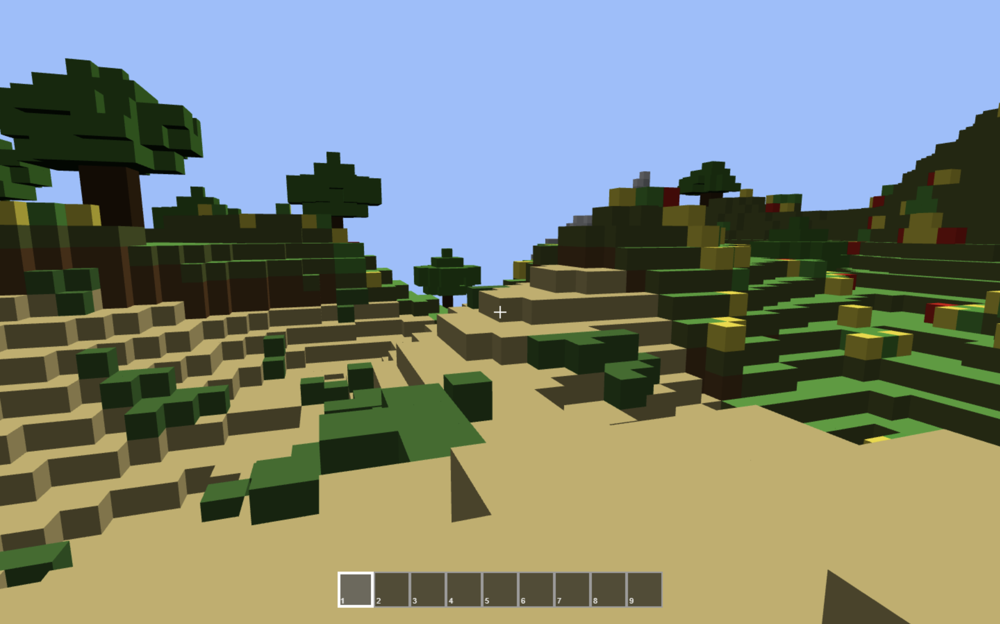

# Minecraft WebXR

Un clone de Minecraft open-source développé avec **Babylon.js** et **Rust (WebAssembly)**, conçu pour fonctionner dans le navigateur avec un support expérimental pour la Réalité Virtuelle (WebXR) et les contrôles mobiles.



| Environnement | Lien                                       |
|---------------|--------------------------------------------|
| Staging       | https://staging.minecraft-xr.nicovers06.fr |
| Production    | https://minecraft-xr.nicovers06.fr         |

| Documentation Technique                                          | Guide de jeu                                                                |
|------------------------------------------------------------------|-----------------------------------------------------------------------------|
| https://nicolachoquet06250.github.io/minecraft-webxr/README.html | https://nicolachoquet06250.github.io/minecraft-webxr/game-guide/README.html |

## 🚀 Fonctionnalités

-   **Moteur de Voxel Performant** : Utilisation de Rust via WebAssembly pour la génération de chunks et le bruit (noise) afin de garantir des performances optimales.
-   **Rendu 3D avec Babylon.js** : Un moteur de rendu puissant pour gérer les meshes de chunks, l'éclairage, les interfaces Babylon GUI et les effets visuels.
-   **Génération Procédurale** : Mondes générés dynamiquement à l'aide d'un algorithme de bruit, avec chargement progressif des chunks autour du joueur.
-   **Support Multi-plateforme** :
    -   **Clavier/Souris** : Contrôles classiques (ZQSD + Souris), verrouillage du pointeur et interactions au clic.
    -   **Mobile** : Commandes tactiles adaptées avec joysticks virtuels, boutons d'action et interface de craft.
    -   **WebXR** : Support de la réalité virtuelle pour une immersion totale avec contrôleurs VR.
-   **Physique & Interaction** : Système de physique pour le joueur, collision avec les blocs, auto-jump, placement de blocs et mécanique de destruction progressive.
-   **Système d'Inventaire** : Barre d'inventaire, sélection de slot, objets lâchés (dropped items) et ramassage automatique.
-   **Système de Craft** : Interface de craft en surimpression avec grille 3x3, inventaire, résultat de recette et drag & drop.
-   **Blocs & Items** : Définitions modulaires des blocs, items, textures procédurales 16x16, minerais, blocs naturels, arbres, plantes, blocs décoratifs et laines.
-   **Eau** : Blocs d'eau non pleins en hauteur avec shader dédié, effet de légères vagues et effet de plouf lorsque le joueur entre dans l'eau.
-   **Plantes 3D** : Chargement de modèles 3D pour certaines plantes comme les poppies.
-   **PWA** : Support Progressive Web App avec service worker, mise à jour automatique et fonctionnement hors ligne lorsque l'application est prête.

## 🛠️ Stack Technique

-   **Frontend** : TypeScript, Vite.js
-   **Moteur 3D** : Babylon.js, Babylon.js GUI, Babylon.js Loaders
-   **Core (Calculs)** : Rust (compilé en WASM via `wasm-pack`)
-   **Mathématiques & Bruit** : `noise` crate (Rust)
-   **PWA** : `vite-plugin-pwa`
-   **Tests & Outillage** : TypeScript, Playwright, Cargo tests

## 📦 Installation & Développement

### Prérequis

-   [Node.js](https://nodejs.org/) (v24+)
-   [Rust & Cargo](https://rustup.rs/)
-   [`wasm-pack`](https://rustwasm.github.io/wasm-pack/installer/)

### Étapes d'installation

1.  **Cloner le dépôt** :
    ```bash
    git clone https://github.com/nicolachoquet06250/minecraft-webxr.git
    cd minecraft-webxr
    ```

2.  **Installer les dépendances Node.js** :
    ```bash
    npm install
    ```

3.  **Lancer le serveur de développement** :
    ```bash
    npm run dev
    ```
    *Cette commande compilera automatiquement le code Rust en WebAssembly et lancera le serveur Vite.*

### Commandes disponibles

-   `npm run dev` : Compile le WASM et lance le serveur de dev.
-   `npm run build` : Compile le WASM, le TypeScript et génère le build de production dans `dist/`.
-   `npm run build:wasm` : Compile uniquement la partie Rust/WASM.
-   `npm run preview` : Prévisualise le build de production localement.

## 🕹️ Contrôles

| 💻 Desktop                                                                                            | 📱 Mobile                                                                                                    | 🥽 VR (WebXR)                                                                                                                           |
| ------------------------------------------------------------------------------------------------------ | ------------------------------------------------------------------------------------------------------------ | ---------------------------------------------------------------------------------------------------------------------------------------- |
| **Déplacement** : `Z` `Q` `S` `D` / `W` `A` `S` `D` ou touches fléchées.                               | **Déplacement** : Joystick virtuel à gauche de l'écran.                                                      | **Activation** : Cliquer sur l'icône VR en bas à droite ou lancer le jeu directement en mode VR depuis le menu compatible.               |
| **Sauter** : `Espace`.                                                                                 | **Regarder** : Joystick virtuel à droite de l'écran.                                                         | **Déplacement** : Joystick / touchpad du contrôleur gauche.                                                                              |
| **Regarder** : Souris (cliquer pour verrouiller le pointeur).                                          | **Sauter** : Bouton dédié à droite.                                                                          | **Orientation** : Suivi naturel du casque WebXR.                                                                                         |
| **Détruire un bloc** : Clic gauche maintenu.                                                           | **Détruire un bloc** : Bouton dédié à droite avec l'icône pioche.                                            | **Sauter** : Bouton `A` du contrôleur droit.                                                                                             |
| **Placer un bloc** : Clic droit.                                                                       | **Placer un bloc** : Bouton dédié à gauche.                                                                  | **Détruire un bloc** : Trigger droit avec le rayon du contrôleur droit.                                                                  |
| **Craft** : `E` pour ouvrir/fermer l'interface de craft, `Échap` pour fermer.                          | **Craft** : Bouton `Craft` en haut à droite.                                                                 | **Placer un bloc** : Trigger gauche avec le rayon du contrôleur gauche.                                                                  |
| **Craft - Drag & Drop** : Clic gauche pour déplacer 1 item, clic droit pour déplacer le stack complet. | **Craft - Drag & Drop** : Interactions tactiles sur l'inventaire, la grille de craft et le slot de résultat. | **Inventaire VR** : Barre d'inventaire dédiée au mode VR, attachée au corps du joueur et sélectionnable avec les rayons des contrôleurs. |
|                                                                                                        |                                                                                                              | **Pointeur central** : Masqué en mode VR.                                                                                                |

## 📂 Structure du projet

-   `src/` : Code source TypeScript (Babylon.js, événements, contrôles).
-   `src/blocks/` : Définitions modulaires des blocs et de leurs textures procédurales.
-   `src/items/` : Définitions des items, outils et icônes d'inventaire.
-   `src/crafts/` : Recettes de craft et patterns associés.
-   `wasm/` : Code source Rust (génération de chunks, logique bas niveau).
-   `public/` : Assets statiques.

## 📚 Anexes

Logiciel de modélisation des models 3D voxels: [voxigen](https://voxigen.io/fr/modeler)

## 📄 Licence

Ce projet est sous licence [MIT](LICENSE).
