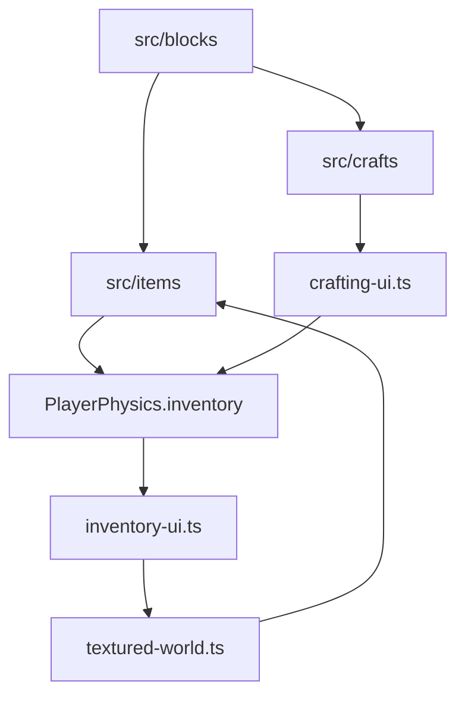
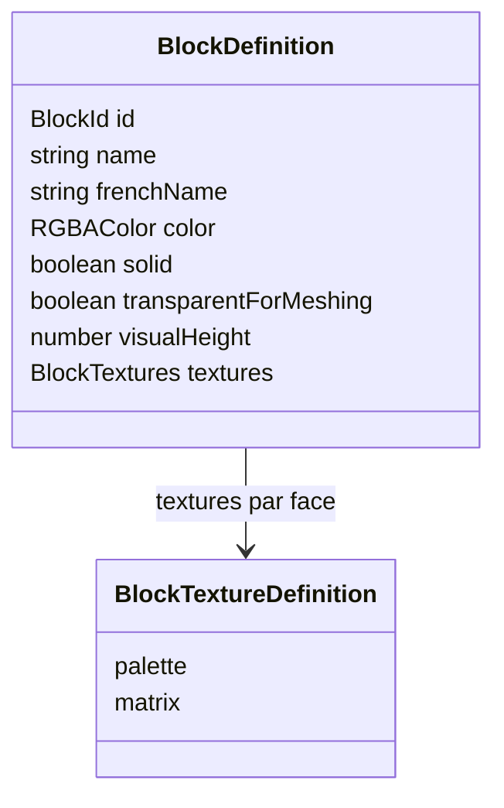
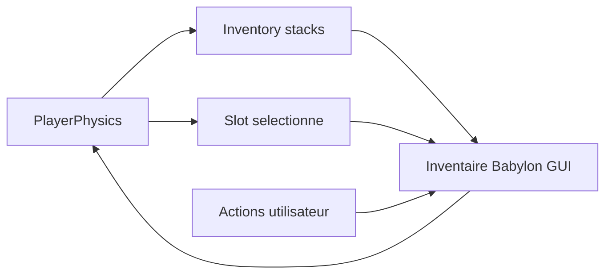
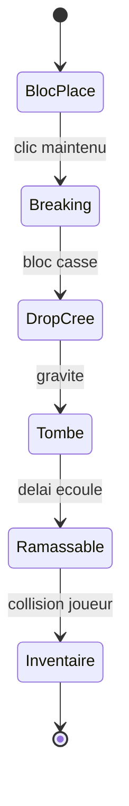
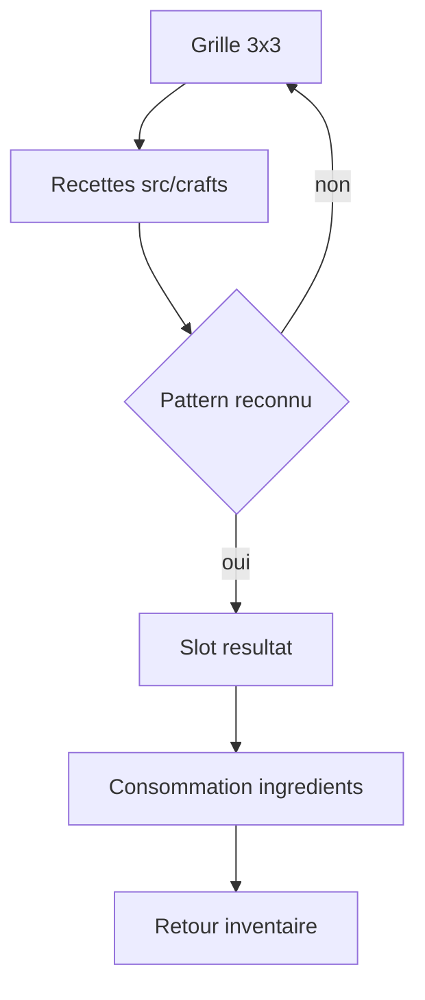
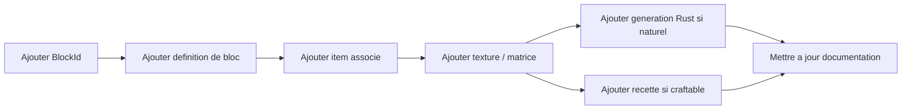

[⬅️ Précédent](./architecture.md) | [Sommaire](./README.md) | [Suivant ➡️](./gameplay-interactions.md)

---

# Blocs, items, inventaire et craft

## Vue d'ensemble

Le projet sépare les blocs, les items, les recettes de craft et les interfaces. Cette séparation permet d'ajouter du contenu sans mélanger rendu, inventaire et gameplay.

## Blocs

Les blocs sont définis dans `src/blocks/` et agrégés dans `src/blocks/index.ts`.

Une définition contient notamment :

- un `BlockId` ;
- un nom anglais ;
- un nom français ;
- une couleur fallback ;
- un état solide ou transparent ;
- une hauteur visuelle optionnelle ;
- des textures procédurales par face.

## Items

Les items sont définis dans `src/items/`. Tous les blocs sauf `Air` ont un item associé. Les blocs ont un stack maximum de 64, tandis que les outils peuvent définir une limite différente.

## Inventaire

L'inventaire est porté par le joueur via `PlayerPhysics`. Il stocke les stacks et le slot sélectionné. L'UI d'inventaire affiche les items et permet la sélection.

## Drops

Quand un bloc est cassé, un drop est créé dans le monde. Il tombe, rebondit légèrement, puis peut être ramassé automatiquement par le joueur après un court délai.

## Craft

Le craft utilise une grille 3x3, un slot de résultat et une barre d'inventaire. Les recettes sont déclarées dans `src/crafts/` sous forme de patterns.

## Règles actuelles

- Clic gauche dans le craft : déplacer 1 item.
- Clic droit : déplacer le stack complet.
- Récupérer le résultat consomme les ingrédients.
- Fermer le craft renvoie les ingrédients restants à l'inventaire.

## Ajout de contenu

Pour ajouter un bloc complet : ajouter le `BlockId`, la définition de bloc, l'item, les textures, éventuellement la génération Rust et les recettes.

---

[⬅️ Précédent](./architecture.md) | [Sommaire](./README.md) | [Suivant ➡️](./gameplay-interactions.md)
