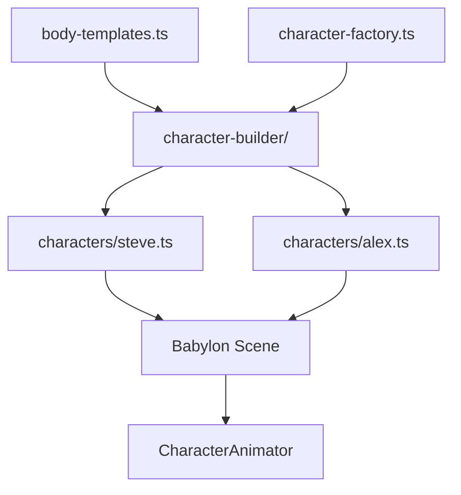
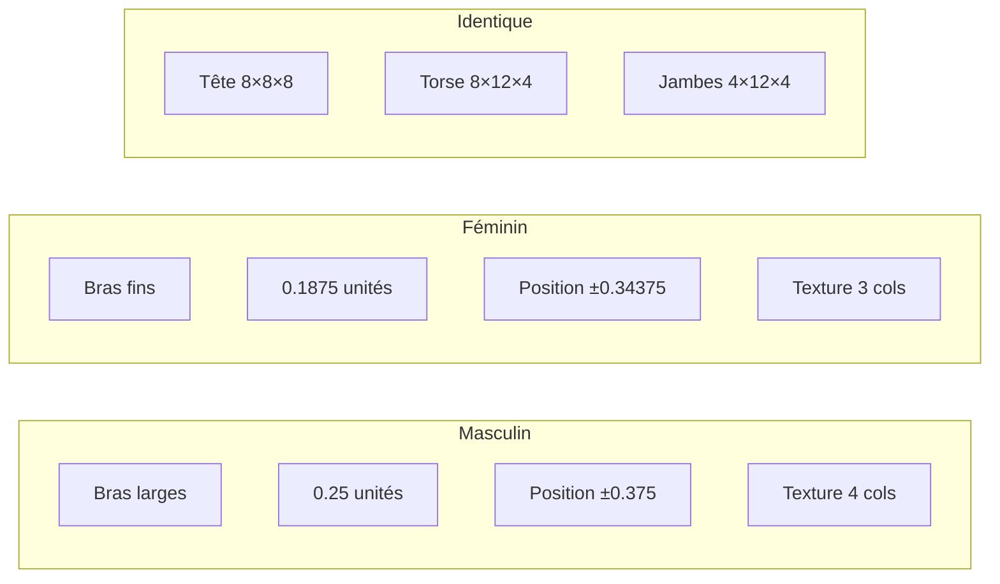

[⬅️ Précédent](./gameplay-interactions.md) | [Sommaire](./README.md) | [Suivant ➡️](./pwa-assets.md)

---

# Système de Personnages

## Vue d'ensemble

Le jeu dispose d'un système complet de construction de personnages permettant de créer des personnages cubiques de style Minecraft avec des textures procédurales. Le système supporte **trois types de corps** : masculin (Steve), féminin (Alex) et personnalisé.



## Architecture du système

### Modules principaux

Le système est organisé en deux dossiers principaux :

#### `src/character-builder/` - Système générique

| Fichier | Rôle |
|---------|------|
| `types.ts` | Définitions TypeScript pour personnages et parties du corps |
| `texture-builder.ts` | Création de textures dynamiques à partir de matrices de couleurs |
| `mesh-builder.ts` | Construction de cuboïdes avec textures sur 6 faces |
| `character-builder.ts` | Assemblage des parties du corps en personnage complet |
| `animator.ts` | Gestion des animations du personnage |
| `body-templates.ts` | Templates prédéfinis pour corps masculins et féminins |
| `character-factory.ts` | Helpers de création rapide de personnages |

#### `src/characters/` - Personnages spécifiques

| Fichier | Rôle |
|---------|------|
| `steve.ts` | Helper de création de Steve |
| `steve-model.ts` | Modèle masculin (bras larges) |
| `steve-animations.ts` | Animations de Steve |
| `steve-color-matrices.ts` | Palette et textures de Steve |
| `alex.ts` | Helper de création d'Alex |
| `alex-model.ts` | Modèle féminin (bras fins) |
| `alex-animations.ts` | Animations d'Alex |
| `alex-color-matrices.ts` | Palette et textures d'Alex |
| `examples.ts` | 5 exemples d'utilisation du système |

## Types de corps

### Masculin (Type Steve)

Le type masculin utilise des **bras larges** pour un style robuste et imposant.

**Dimensions :**
- Bras : 4×12×4 pixels → 0.25 × 0.75 × 0.25 unités
- Position : ±0.375 du centre du torse
- Texture : 4 colonnes de pixels pour les bras

**Autres parties (identiques à tous les types) :**
- Tête : 8×8×8 pixels → 0.5 × 0.5 × 0.5 unités
- Torse : 8×12×4 pixels → 0.5 × 0.75 × 0.25 unités
- Jambes : 4×12×4 pixels → 0.25 × 0.75 × 0.25 unités

### Féminin (Type Alex)

Le type féminin utilise des **bras fins** pour un style élancé et gracieux.

**Dimensions :**
- Bras : 3×12×4 pixels → 0.1875 × 0.75 × 0.25 unités
- Position : ±0.34375 du centre du torse
- Texture : 3 colonnes de pixels pour les bras

**Autres parties :** identiques au type masculin

### Custom (Personnalisé)

Le type custom permet de définir **toutes les dimensions manuellement** pour créer des personnages uniques (géants, enfants, créatures, etc.).

## Utilisation

### 1. Utiliser les personnages par défaut

```typescript
import { createSteve, createAlex } from "./characters";
import { Vector3 } from "@babylonjs/core";

// Créer Steve (masculin)
const { mesh: steveMesh, animator: steveAnimator } = createSteve(
  scene,
  new Vector3(0, 0, 0)
);
steveAnimator.play("walk");

// Créer Alex (féminin)
const { mesh: alexMesh, animator: alexAnimator } = createAlex(
  scene,
  new Vector3(2, 0, 0)
);
alexAnimator.play("mine");
```

### 2. Créer des personnages personnalisés

```typescript
import {
  createMasculineCharacter,
  createFeminineCharacter,
  buildCharacter,
} from "./character-builder";
import type { ColorPalette, CharacterTextures } from "./character-builder";

// Palette de couleurs personnalisée
const warriorPalette: ColorPalette = {
  A: [0.5, 0.0, 0.0, 1], // Rouge
  B: [0.3, 0.3, 0.3, 1], // Gris
  C: [0.8, 0.8, 0.8, 1], // Blanc
  // ... autres couleurs
};

// Textures personnalisées (matrices 16x16)
const warriorTextures: CharacterTextures = {
  head: { /* ... */ },
  torso: { /* ... */ },
  // ...
};

// Créer un guerrier masculin
const warrior = createMasculineCharacter(
  "warrior",
  warriorPalette,
  warriorTextures
);
const warriorMesh = buildCharacter(scene, warrior, new Vector3(5, 0, 0));

// Créer une mage féminine
const mage = createFeminineCharacter("mage", magePalette, mageTextures);
const mageMesh = buildCharacter(scene, mage, new Vector3(7, 0, 0));
```

### 3. Utiliser les templates

```typescript
import { getBodyTemplate, createBodyPartFromTemplate } from "./character-builder";

// Récupérer un template
const masculineTemplate = getBodyTemplate("masculine");
const feminineTemplate = getBodyTemplate("feminine");

// Créer des parties à partir du template
const bodyParts = masculineTemplate.map((part) =>
  createBodyPartFromTemplate(part, myTextures[part.name])
);
```

## Animation

Le système d'animation fonctionne de la même façon pour tous les types de personnages.

```typescript
import { CharacterAnimator } from "./character-builder";

// Créer un animateur
const animator = new CharacterAnimator(characterMesh, scene);

// Charger les animations
animator.loadAnimations(steveAnimations); // ou alexAnimations

// Jouer une animation
animator.play("walk", true, 1.0); // nom, loop, vitesse

// Arrêter l'animation
animator.stop();

// Obtenir l'animation courante
const current = animator.getCurrentAnimation();
```

### Animations disponibles

Toutes les animations sont disponibles pour Steve et Alex :

| Animation | Description | Usage |
|-----------|-------------|-------|
| `idle` | Position debout neutre | Par défaut quand le joueur ne bouge pas |
| `walk` | Marche avec mouvement des bras | Quand le joueur se déplace |
| `mine` | Animation de minage | Quand le joueur casse un bloc |
| `jump` | Saut | Quand le joueur saute |

## Comparaison des types



## Textures procédurales

Les textures sont définies par des **matrices 16×16** avec une palette de couleurs RGBA.

```typescript
import { createTextureFromMatrix } from "./character-builder";

const headMatrix = [
  ["A", "A", "A", "A", "A", "A", "A", "A", ...], // ligne 1
  ["A", "B", "B", "B", "B", "B", "B", "A", ...], // ligne 2
  // ... 14 autres lignes
];

const palette: ColorPalette = {
  A: [0.8, 0.6, 0.4, 1], // Peau
  B: [0.3, 0.2, 0.1, 1], // Cheveux
  // ...
};

const texture = createTextureFromMatrix(scene, "head_texture", {
  palette,
  matrix: headMatrix,
});
```

## Palettes de couleurs par défaut

### Steve (Masculin)

- **Cheveux** : Marron foncé
- **T-shirt** : Cyan
- **Pantalon** : Bleu
- **Peau** : Bronzée

### Alex (Féminin)

- **Cheveux** : Roux
- **Haut** : Vert
- **Pantalon** : Marron
- **Peau** : Claire

## Utilisation dans le jeu

### Intégration avec le joueur

```typescript
// Dans main.ts ou équivalent
const { mesh: playerMesh, animator: playerAnimator } = createSteve(
  scene,
  new Vector3(SPAWN_X, spawnY, SPAWN_Z)
);

// Suivre le joueur avec la caméra
camera.lockedTarget = playerMesh;

// Animation selon l'état
if (player.velocity.length() > 0.01) {
  playerAnimator.play("walk");
} else {
  playerAnimator.play("idle");
}
```

### Gestion de la physique des personnages

La physique personnage est **active par défaut** lors de la création via `buildCharacter()`, `createSteve()` ou `createAlex()`.

```typescript
// Physique active par défaut (options omises)
const { mesh, animator, physics } = createSteve(scene, new Vector3(0, 0, 0));

// Important : update() doit être appelée à chaque frame
physics?.update({
  worldChunks,
  sizeX,
  sizeY,
  sizeZ,
  deltaTime,
});
```

Si vous souhaitez déléguer complètement la simulation au serveur (ou à une source externe), deux approches sont possibles :

```typescript
// 1) Désactiver totalement la physique locale
const serverDriven = createSteve(scene, spawnPos, { physics: false });

// 2) Garder le contrôleur mais basculer en contrôle externe
const { physics } = createSteve(scene, spawnPos, {
  physics: { externalControl: true },
});

// Tick réseau : appliquer les états venant du serveur
physics?.teleport(serverState.position);
physics?.setVelocity(serverState.velocity);
```

En mode `externalControl`, `update()` n'applique ni gravité ni collisions locales : la position est pilotée depuis l'extérieur.

### Support multi-joueur (futur)

Le système permet facilement de créer plusieurs personnages avec des types différents :

```typescript
const players = [
  { name: "Player1", type: "masculine", position: new Vector3(0, 0, 0) },
  { name: "Player2", type: "feminine", position: new Vector3(5, 0, 0) },
];

players.forEach((p) => {
  const character =
    p.type === "masculine" ? createSteve(scene, p.position) : createAlex(scene, p.position);
  // Ajouter au monde...
});
```

## Avantages du système

1. **Réalisme** - Proportions anatomiques différentes entre masculin et féminin
2. **Flexibilité** - Créer facilement des variantes sans réécrire tout le code
3. **Réutilisabilité** - Templates et factories partagés
4. **Simplicité** - API claire et intuitive
5. **Type-safe** - TypeScript pour tous les types et interfaces
6. **Extensible** - Facile d'ajouter de nouveaux types de corps
7. **Performant** - Réutilisation de code et d'assets

## Futures évolutions possibles

### Variations de taille

```typescript
// Enfant (plus petit)
const childTemplate = getScaledTemplate("masculine", 0.7);

// Géant (plus grand)
const giantTemplate = getScaledTemplate("feminine", 1.5);
```

### Plus de types de corps

- Athlétique (muscles prononcés)
- Robuste (plus large)
- Élancé (plus fin)
- Créatures (proportions non-humaines)

### Bibliothèque de skins

```typescript
import { loadMinecraftSkin } from "./character-builder";

const customSkin = await loadMinecraftSkin("https://textures.minecraft.net/...");
const character = createFromSkin(customSkin, "masculine");
```

### Éditeur de personnages

Interface visuelle pour :
- Choisir le type de corps
- Personnaliser les couleurs
- Prévisualiser en temps réel
- Exporter/importer les configurations

## Export SVG des personnages

Le système supporte l'export de personnages sous forme d'images SVG en perspective avec support complet des :
- Poses animées (lever les bras, tourner la tête, etc.)
- Perspectives 3D (caméra configurable)
- Textures matricielles colorées

Pour une documentation complète sur l'export SVG, consultez :
- **[character-svg-export.md](./character-svg-export.md)** - Export SVG complet avec poses

### Exemple d'export

```typescript
import { createSteveSvg } from "./characters/steve";

// Générer un SVG avec pose personnalisée
const svg = createSteveSvg(
  scene,
  new Vector3(0, 0, 0),
  { physics: false },
  {
    width: 512,
    height: 512,
    pose: {
      parts: {
        rightArm: { rotation: { x: -1.2 } }, // Lever le bras
      },
    },
  }
);

// Utiliser le SVG (téléchargement, affichage, etc.)
```

## Documentation complète

Pour plus de détails techniques, consultez :

- `src/character-builder/README.md` - Guide complet du système de construction
- `src/character-builder/BODY_TYPES.md` - Détails sur les différences de corps
- `src/characters/examples.ts` - 5 exemples pratiques
- `CHARACTER_SYSTEM_SUMMARY.md` - Résumé du système (racine du projet)
- `GENDER_SUPPORT.md` - Support masculin/féminin (racine du projet)
- **[avatar-physics.md](./avatar-physics.md)** - Physique personnages (active par défaut, mode serveur)
- **[character-svg-export.md](./character-svg-export.md)** - Export SVG et système de poses 📸

---

[⬅️ Précédent](./gameplay-interactions.md) | [Sommaire](./README.md) | [Suivant ➡️](./character-svg-export.md)
