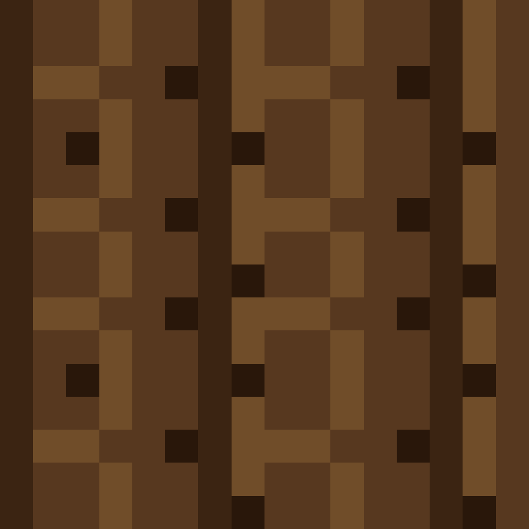
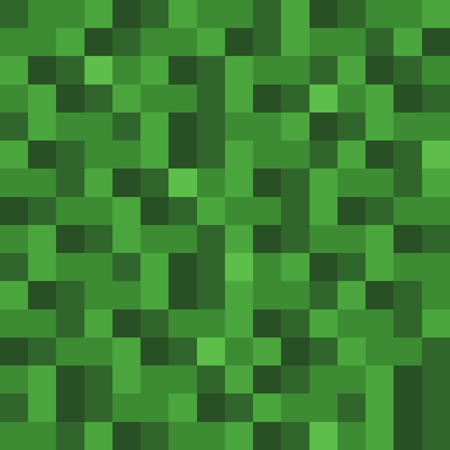
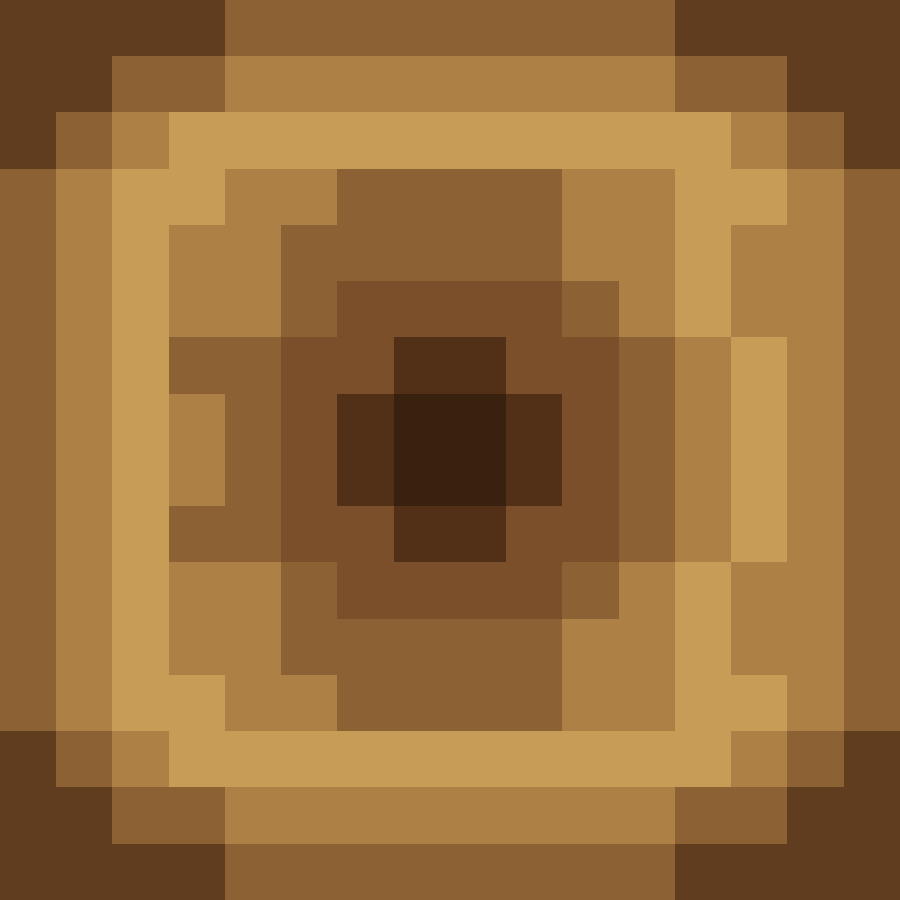

[⬅️ Precedent](./README.md) | [Sommaire](./README.md) | [Suivant ➡️](./items.md)

---

# Blocs disponibles et ou les trouver

Cette page liste les blocs actuellement disponibles dans le jeu avec leur mode d'obtention et des visuels SVG stockes dans `docs/blocks/visuels/`.

## Terrain naturel

| Visuel | Bloc | Nom francais | Ou le trouver |
|--------|------|--------------|---------------|
|  | Grass Block | bloc d'herbe | Surface du biome plaines. |
|  | Dirt | terre | Sous la surface des plaines et de certains biomes enneiges. |
|  | Coarse Dirt | terre sterile | Bloc defini dans le jeu, pas encore genere naturellement. |
|  | Podzol | podzol | Bloc defini dans le jeu, pas encore genere naturellement. |
|  | Rooted Dirt | terre racineuse | Bloc defini dans le jeu, pas encore genere naturellement. |
|  | Stone | pierre | Sous-sol classique et fonds sous-marins. |
|  | Deepslate | ardoise des abimes | Sous-sol profond. |
|  | Granite | granite | Bloc defini dans le jeu, pas encore genere naturellement. |
|  | Diorite | diorite | Bloc defini dans le jeu, pas encore genere naturellement. |
|  | Andesite | andesite | Bloc defini dans le jeu, pas encore genere naturellement. |
|  | Tuff | tuf | Bloc defini dans le jeu, pas encore genere naturellement. |
|  | Calcite | calcite | Bloc defini dans le jeu, pas encore genere naturellement. |
|  | Gravel | gravier | Bloc defini dans le jeu, pas encore genere naturellement. |
|  | Sand | sable | Surface et sous-sol du biome desert. |
|  | Red Sand | sable rouge | Bloc defini dans le jeu, pas encore genere naturellement. |
|  | Clay | argile | Fonds sous-marins dans les zones enneigees. |

## Plantes

| Visuel | Bloc | Nom francais | Ou le trouver |
|--------|------|--------------|---------------|
|  | Poppy | coquelicot | Bloc plant disponible dans les blocs de plantes. |

## Autres categories

### Bois et feuillage de chene

| Visuel | Bloc | Nom francais | Ou le trouver |
|--------|------|--------------|---------------|
|  | Oak Log | buche de chene | Troncs d'arbres dans les biomes temperes. |
|  | Oak Leaves | feuilles de chene | Canopee des chenes, au-dessus des troncs. |

Visuel complementaire pour la face superieure de la buche: .

### Planches de bois

| Visuel | Bloc | Nom francais | Ou le trouver |
|--------|------|--------------|---------------|
|  | Oak Planks | planches de chene | Via craft a partir d'une buche de chene. |
|  | Spruce Planks | planches de sapin | Via craft a partir d'une buche de sapin. |
|  | Birch Planks | planches de bouleau | Via craft a partir d'une buche de bouleau. |
|  | Jungle Planks | planches d'acajou | Via craft a partir d'une buche d'acajou. |
|  | Acacia Planks | planches d'acacia | Via craft a partir d'une buche d'acacia. |
|  | Dark Oak Planks | planches de chene noir | Via craft a partir d'une buche de chene noir. |
|  | Mangrove Planks | planches de paletuvier | Via craft a partir d'une buche de paletuvier. |
|  | Cherry Planks | planches de cerisier | Via craft a partir d'une buche de cerisier. |

### Bloc utilitaire

| Visuel | Bloc | Nom francais | Details |
|--------|------|--------------|---------|
|  | Crafting Table | table de craft | Le bloc utilise des textures differentes selon les faces. |

Les autres blocs disponibles sont les liquides, neige et glace, minerais, troncs, feuilles, plantes, fleurs, blocs decoratifs et utilitaires, ainsi que toutes les laines.

Les pages [Items disponibles](./items.md) et [Crafts possibles](./crafts.md) donnent les informations complementaires.

---

[⬅️ Precedent](./README.md) | [Sommaire](./README.md) | [Suivant ➡️](./items.md)
