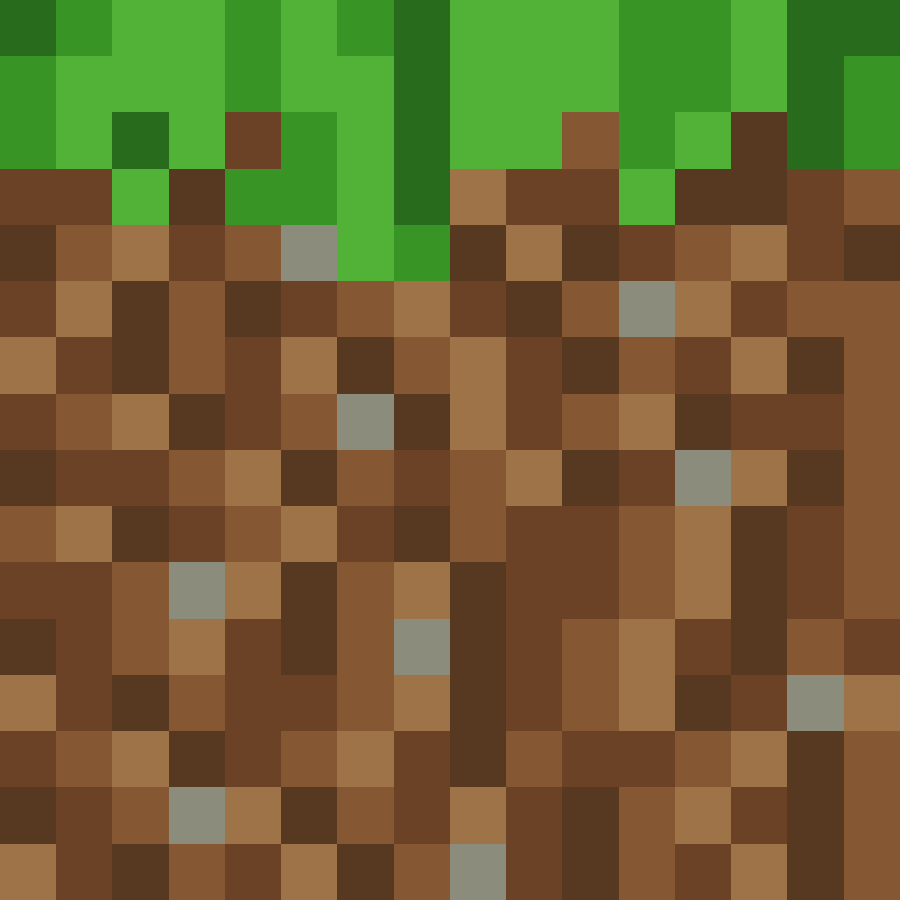
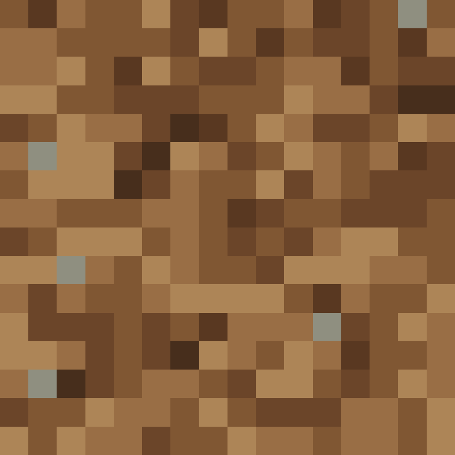
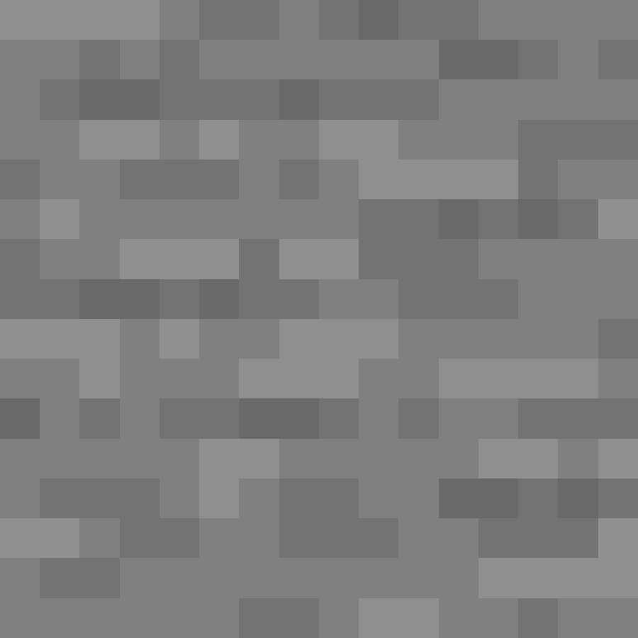
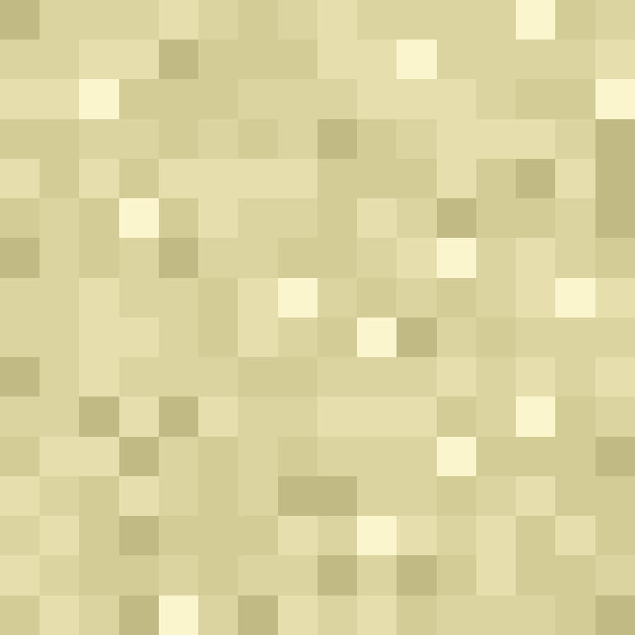
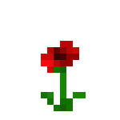

[⬅️ Precedent](./README.md) | [Sommaire](./README.md) | [Suivant ➡️](./items.md)

---

# Blocs disponibles et ou les trouver

Cette page liste les blocs actuellement disponibles dans le jeu avec leur mode d'obtention et des visuels SVG stockes dans `docs/blocks/visuels/`.

## Terrain naturel

| Visuel | Bloc | Nom francais | Ou le trouver |
|--------|------|--------------|---------------|
|  | Grass Block | bloc d'herbe | Surface du biome plaines. |
|  | Dirt | terre | Sous la surface des plaines et de certains biomes enneiges. |
|  | Coarse Dirt | terre sterile | Bloc defini dans le jeu, pas encore genere naturellement. |
|  | Podzol | podzol | Bloc defini dans le jeu, pas encore genere naturellement. |
|  | Rooted Dirt | terre racineuse | Bloc defini dans le jeu, pas encore genere naturellement. |
|  | Stone | pierre | Sous-sol classique et fonds sous-marins. |
|  | Deepslate | ardoise des abimes | Sous-sol profond. |
|  | Granite | granite | Bloc defini dans le jeu, pas encore genere naturellement. |
|  | Diorite | diorite | Bloc defini dans le jeu, pas encore genere naturellement. |
|  | Andesite | andesite | Bloc defini dans le jeu, pas encore genere naturellement. |
|  | Tuff | tuf | Bloc defini dans le jeu, pas encore genere naturellement. |
|  | Calcite | calcite | Bloc defini dans le jeu, pas encore genere naturellement. |
|  | Gravel | gravier | Bloc defini dans le jeu, pas encore genere naturellement. |
|  | Sand | sable | Surface et sous-sol du biome desert. |
|  | Red Sand | sable rouge | Bloc defini dans le jeu, pas encore genere naturellement. |
|  | Clay | argile | Fonds sous-marins dans les zones enneigees. |

## Plantes

| Visuel | Bloc | Nom francais | Ou le trouver |
|--------|------|--------------|---------------|
|  | Poppy | coquelicot | Bloc plant disponible dans les blocs de plantes. |

## Autres categories

Les autres blocs disponibles sont les liquides, neige et glace, minerais, troncs, feuilles, planches, plantes, fleurs, blocs decoratifs et utilitaires, ainsi que toutes les laines.

Les pages [Items disponibles](./items.md) et [Crafts possibles](./crafts.md) donnent les informations complementaires.

---

[⬅️ Precedent](./README.md) | [Sommaire](./README.md) | [Suivant ➡️](./items.md)
