[⬅️ Precedent](./items.md) | [Sommaire](./README.md) | [Suivant ➡️](./controls.md)

---

# Crafts possibles

Cette page liste toutes les recettes de craft actuellement implementees.

## Lire les patterns

Les recettes utilisent une grille 3x3. Le caractere `.` signifie case vide.

## Planches de bois

Les recettes de planches fonctionnent avec une seule buche placee dans n'importe quelle case de la grille. Les visuels ci-dessous sont generes a partir des matrices de texture et de leurs palettes RGBA.

| Visuel | Resultat | Recette |
|--------|----------|---------|
| 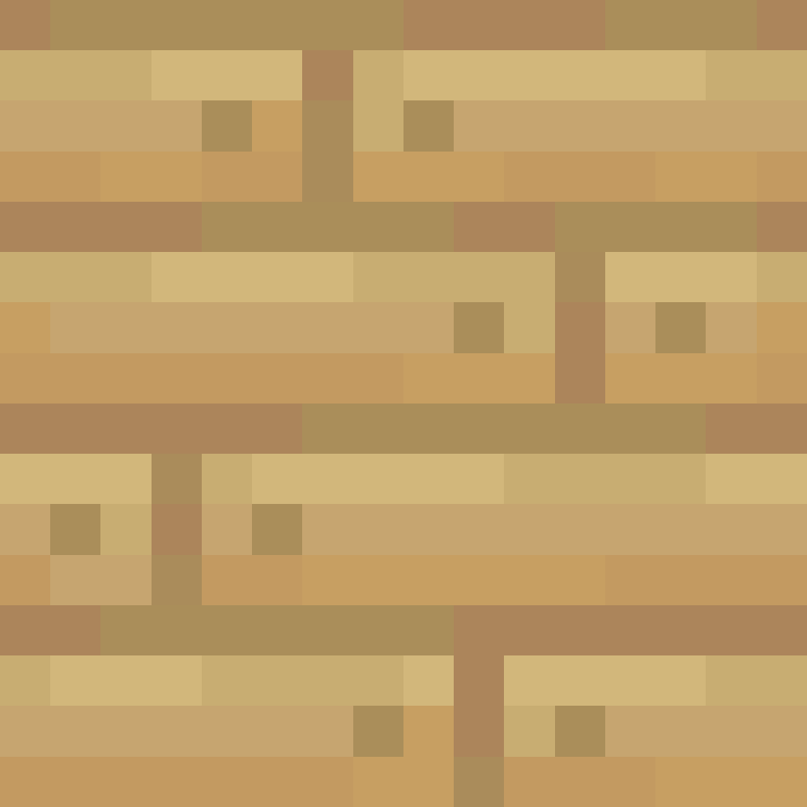 | 4x Oak Planks / planches de chene | 1x Oak Log / buche de chene, dans n'importe quelle case |
| 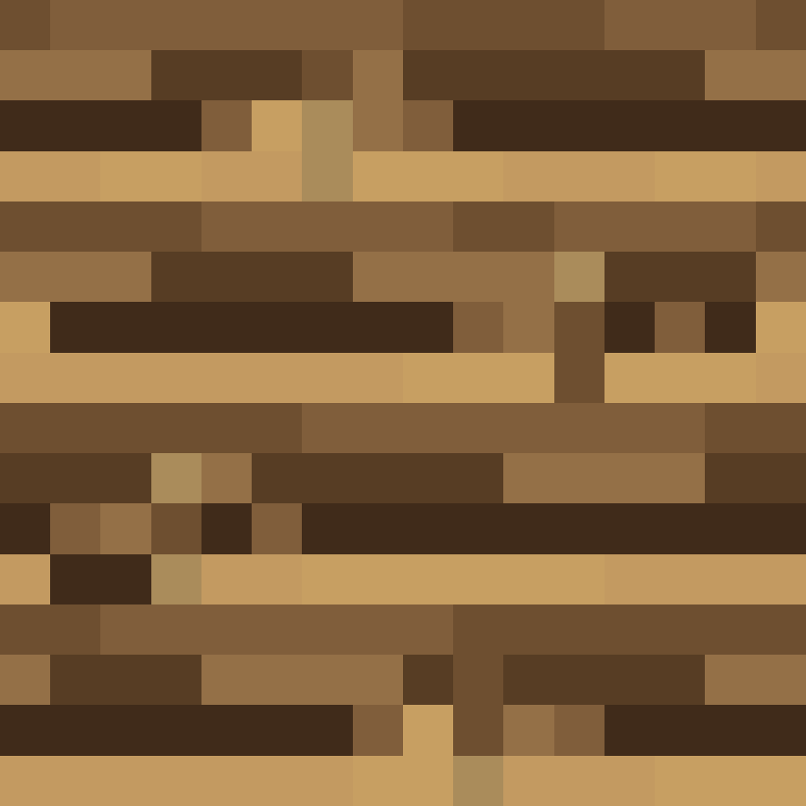 | 4x Spruce Planks / planches de sapin | 1x Spruce Log / buche de sapin, dans n'importe quelle case |
| 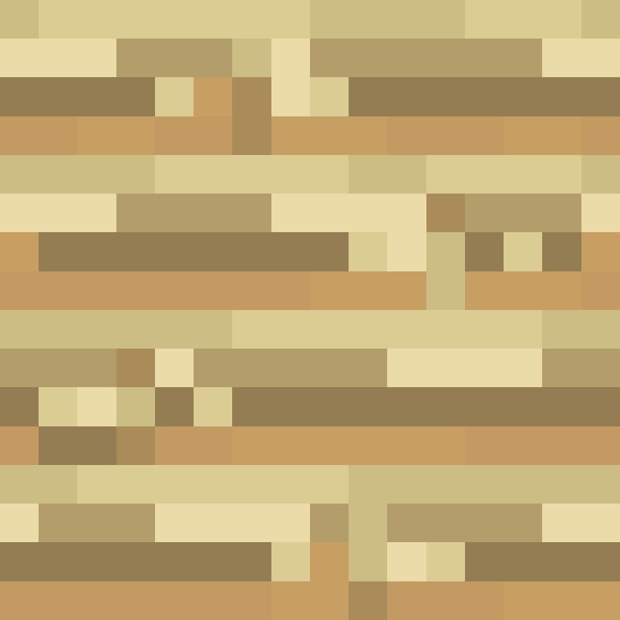 | 4x Birch Planks / planches de bouleau | 1x Birch Log / buche de bouleau, dans n'importe quelle case |
| 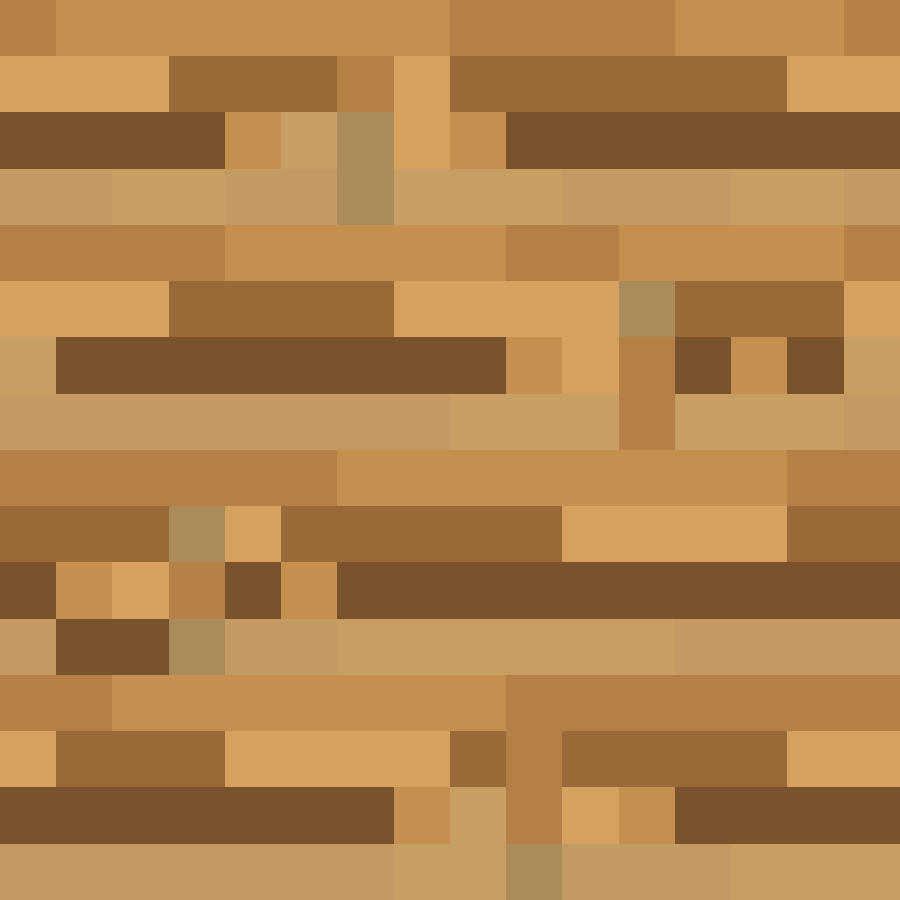 | 4x Jungle Planks / planches d'acajou | 1x Jungle Log / buche d'acajou, dans n'importe quelle case |
| 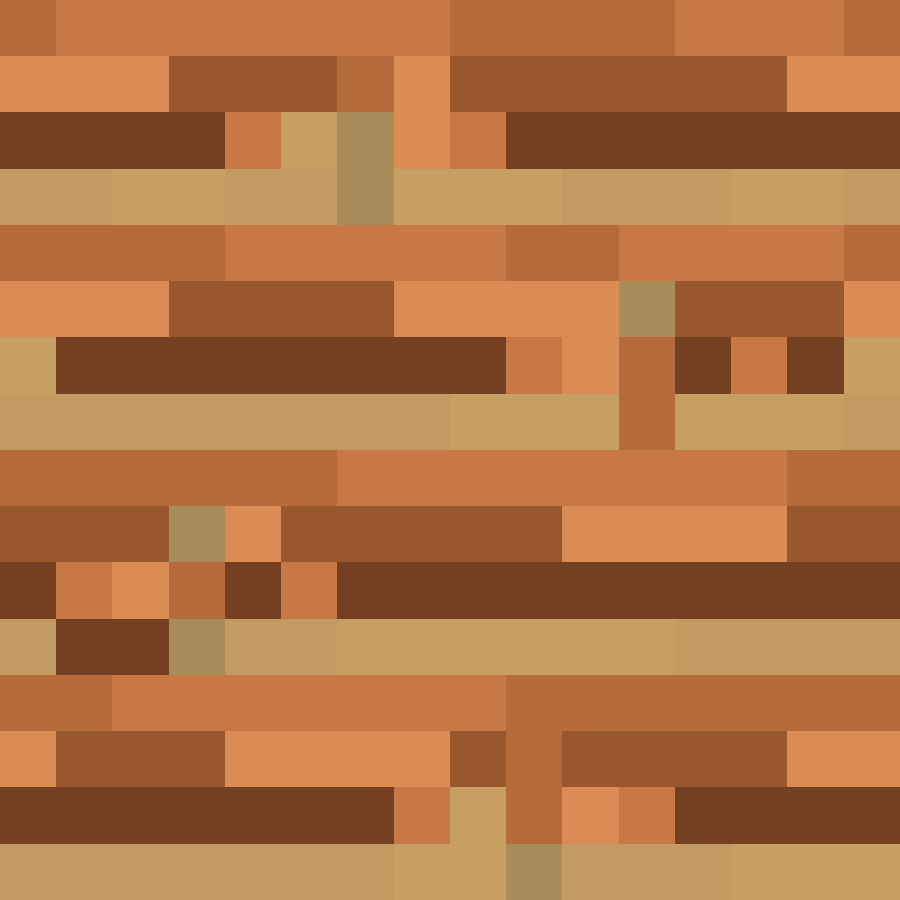 | 4x Acacia Planks / planches d'acacia | 1x Acacia Log / buche d'acacia, dans n'importe quelle case |
| 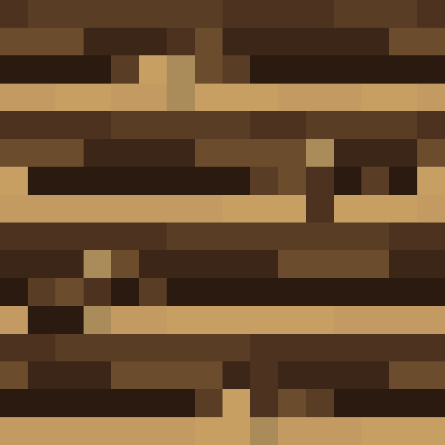 | 4x Dark Oak Planks / planches de chene noir | 1x Dark Oak Log / buche de chene noir, dans n'importe quelle case |
| 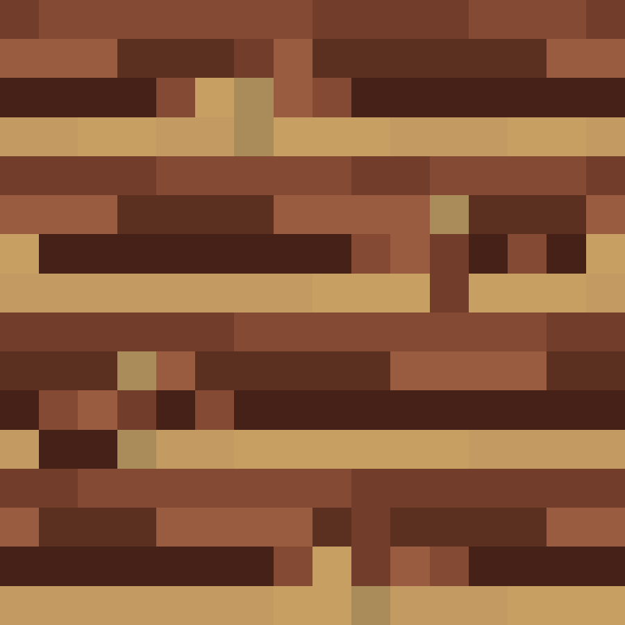 | 4x Mangrove Planks / planches de paletuvier | 1x Mangrove Log / buche de paletuvier, dans n'importe quelle case |
| 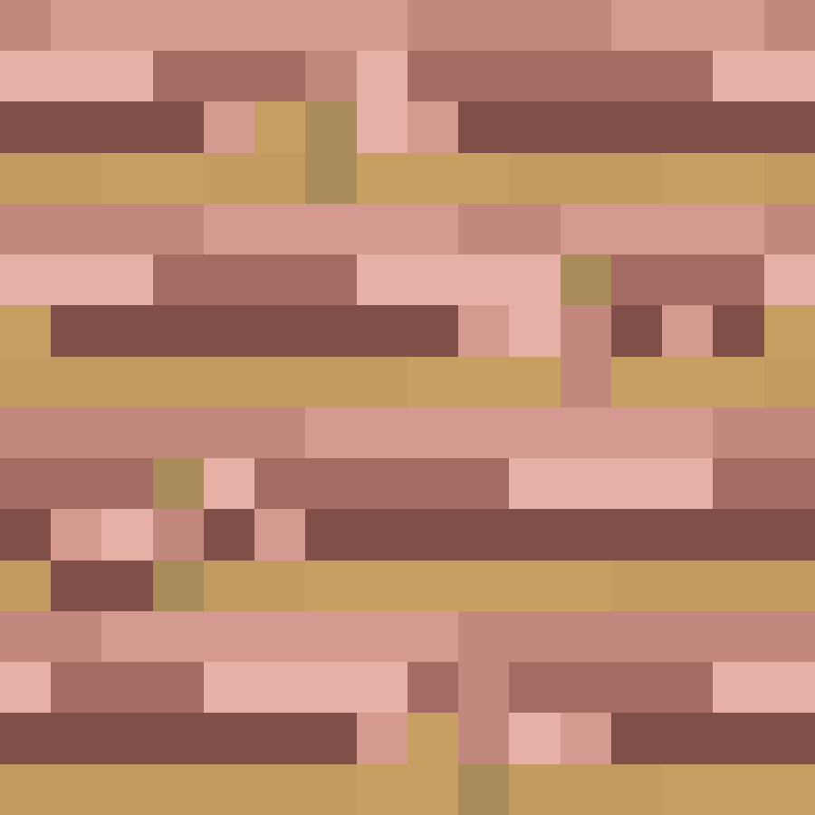 | 4x Cherry Planks / planches de cerisier | 1x Cherry Log / buche de cerisier, dans n'importe quelle case |

## Table de craft

| Visuel | Pattern | Details |
|--------|---------|---------|
| 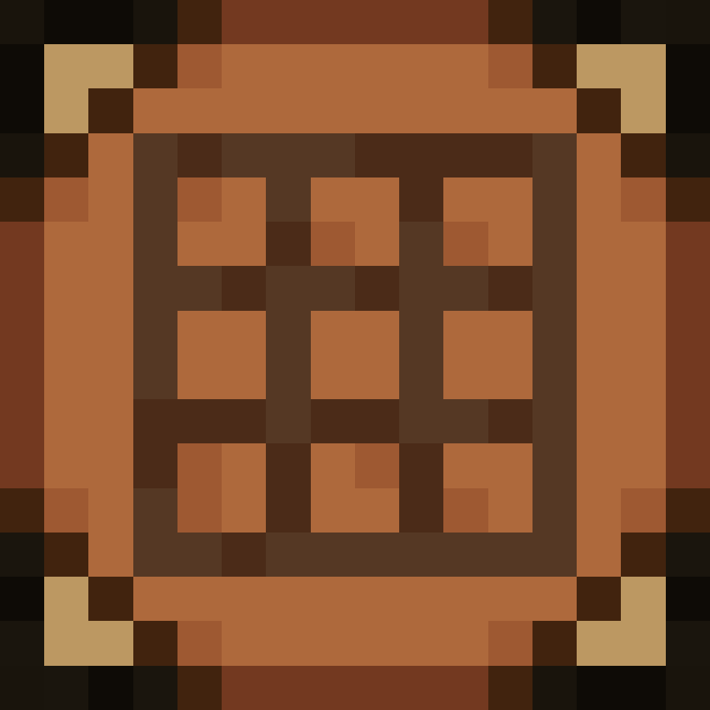 | `P P .` `P P .` `. . .` | `P` = Oak Planks / planches de chene. Resultat : 1x Crafting Table / table de craft. |

### Faces de la table de craft

| Face | Visuel |
|------|--------|
| top |  |
| bottom | 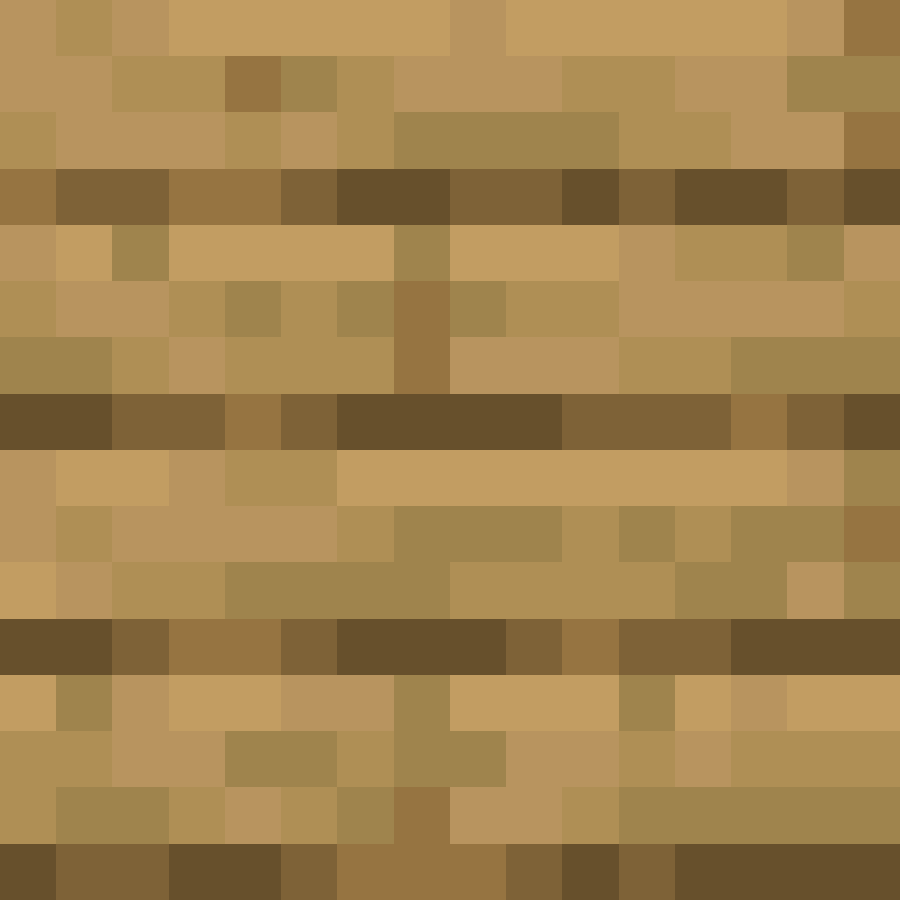 |
| front | 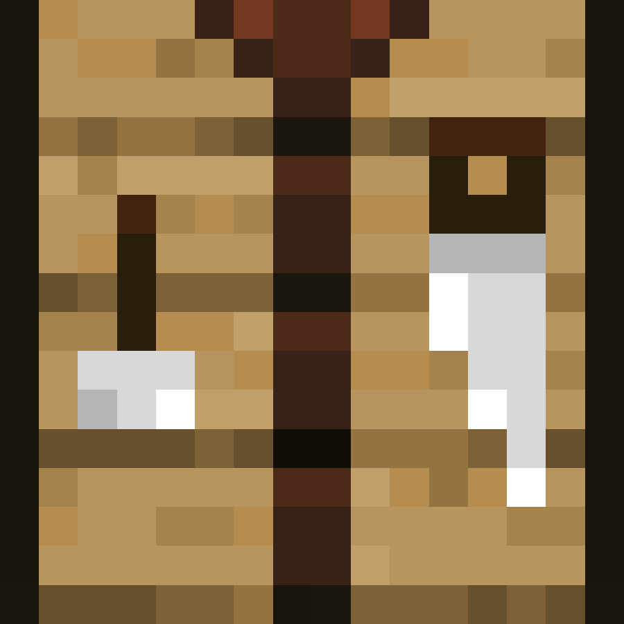 |
| back |  |
| left | 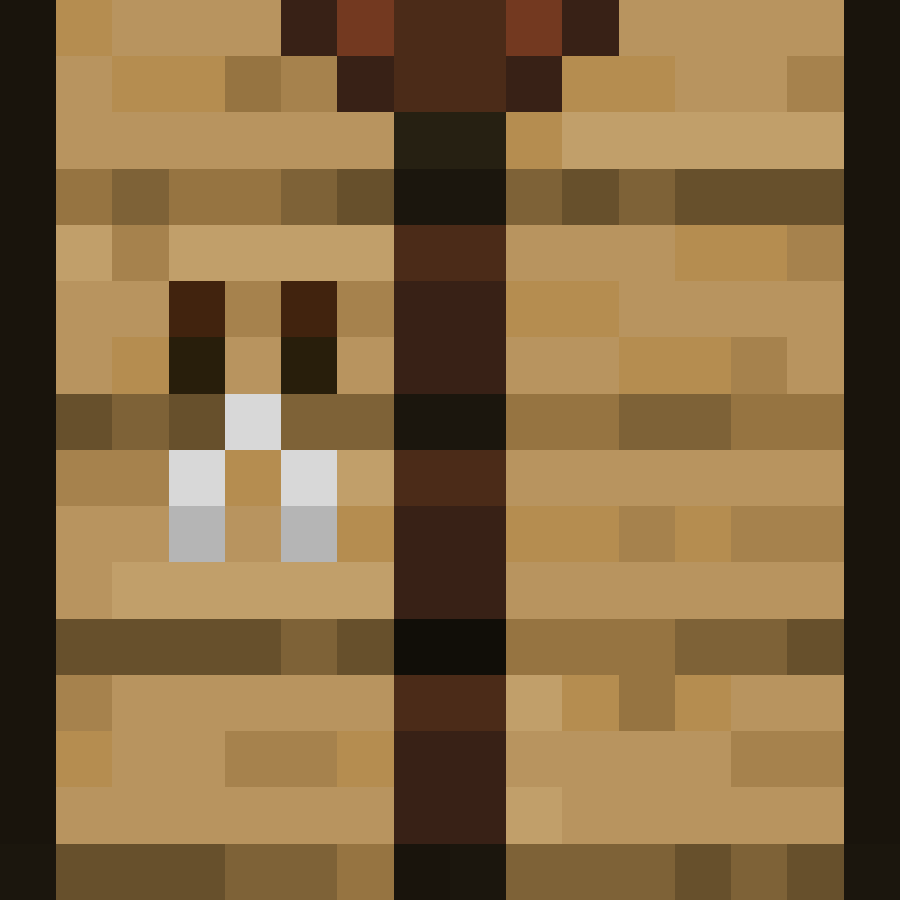 |
| right |  |

## Pioche en terre et herbe

| Visuel | Pattern | Details |
|--------|---------|---------|
|  | `G G G` `. D .` `. D .` | `G` = Grass Block / bloc d'herbe. `D` = Dirt / terre. Resultat : 1x Dirt Grass Pickaxe / pioche en terre et herbe. |

---

[⬅️ Precedent](./items.md) | [Sommaire](./README.md) | [Suivant ➡️](./controls.md)
