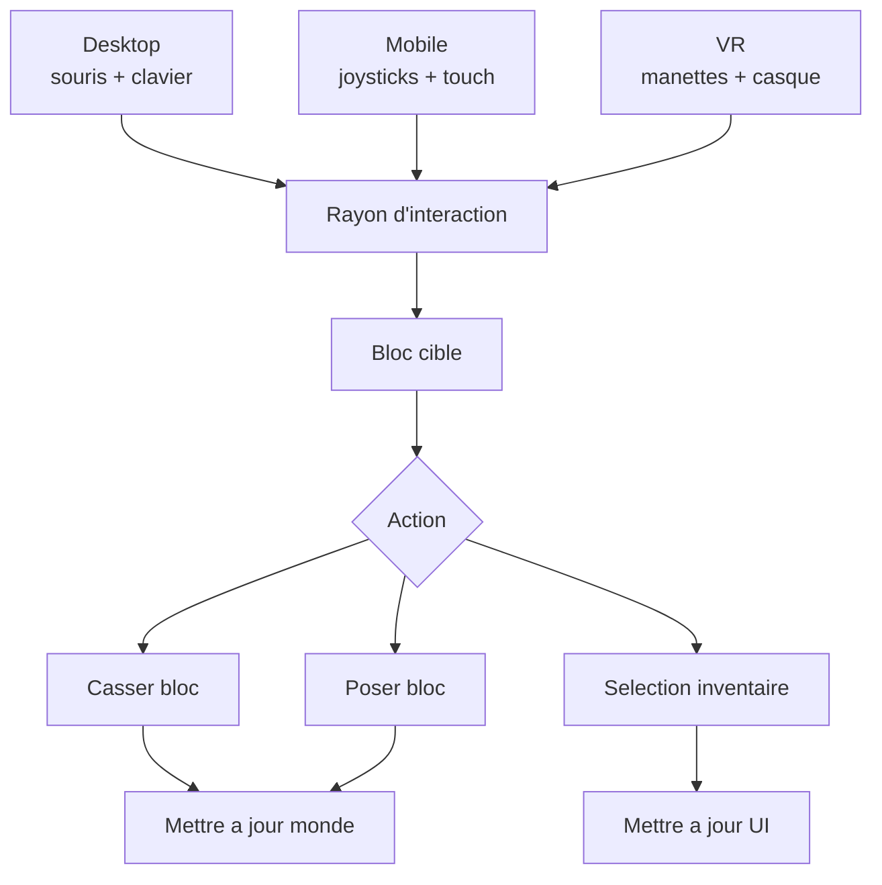
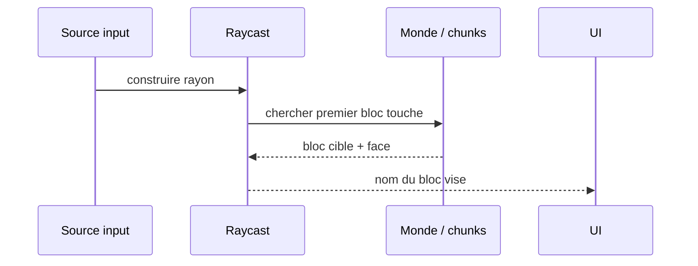
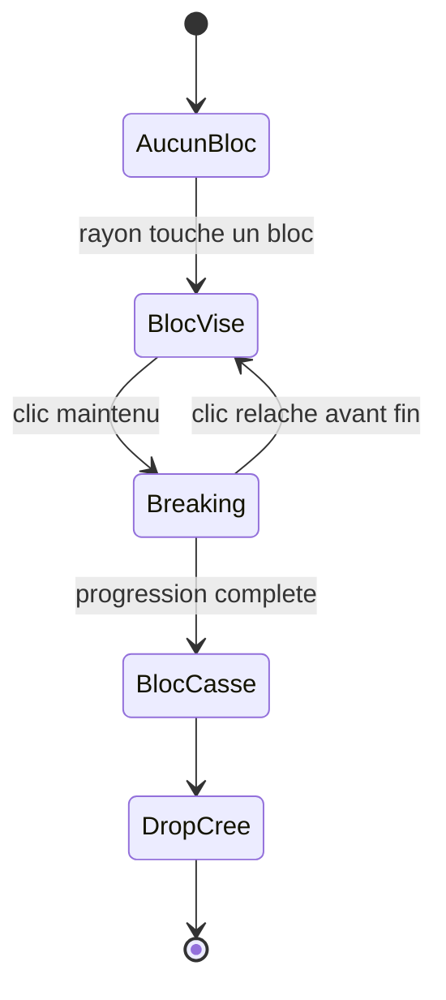
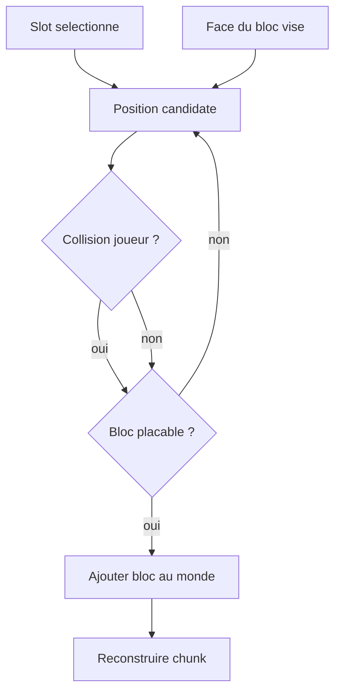
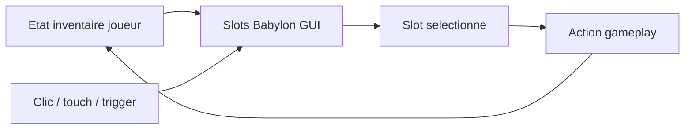

[⬅️ Précédent](./rendering-and-effects.md) | [Sommaire](./README.md) | [Suivant ➡️](./character-system.md)

---

# Interactions de gameplay

Cette page documente les interactions du jeu Minecraft WebXR.

## Vue d'ensemble

Les interactions partent d'une source d'entrée différente selon le device, mais elles convergent vers la même logique de ciblage et de modification du monde.

## Ciblage de bloc

Le jeu determine le bloc vise a partir d'un rayon. En desktop et mobile, ce rayon part du centre de l'ecran. En VR, il peut venir d'une manette.

## Casser un bloc

La casse utilise une progression de breaking. Le bloc n'est retire qu'a la fin du temps de casse defini pour son type.

## Poser un bloc

Le placement utilise le slot selectionne, la face visee et les tests de collision pour eviter de poser un bloc dans le joueur ou dans un espace invalide.

## Inventaire et UI

L'inventaire conserve l'etat gameplay, tandis que Babylon GUI sert uniquement de representation interactive.

---

[⬅️ Précédent](./rendering-and-effects.md) | [Sommaire](./README.md) | [Suivant ➡️](./character-system.md)
