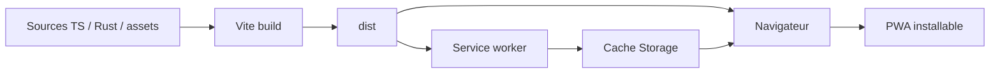
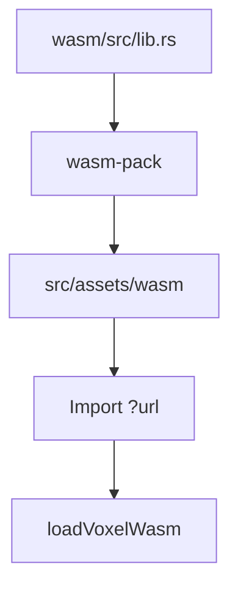
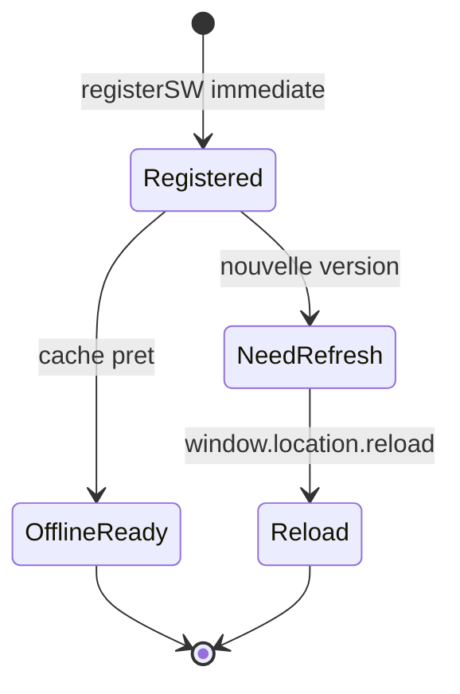
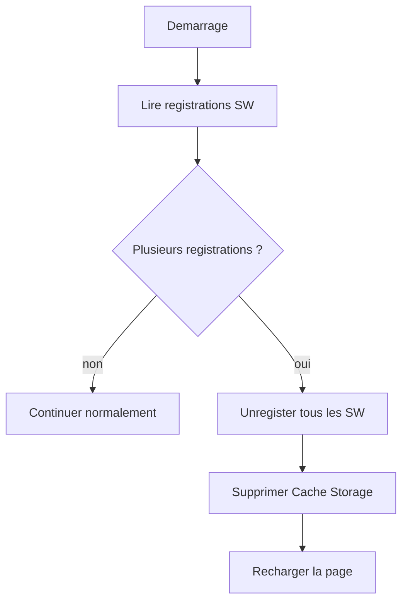
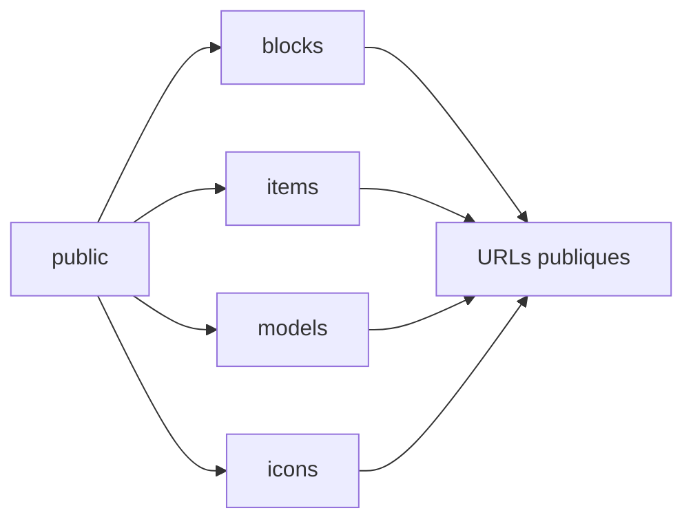
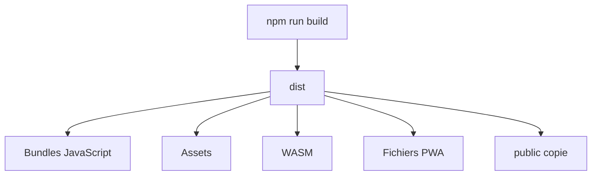

[⬅️ Précédent](./character-svg-export.md) | [Sommaire](./README.md)

---

# PWA, assets et déploiement navigateur

## Vue d'ensemble

Le projet est conçu pour fonctionner dans le navigateur et dispose d'un support PWA.

Les objectifs sont :

- permettre l'installation de l'application ;
- gérer un service worker ;
- supporter le fonctionnement hors ligne lorsque les assets sont prêts ;
- éviter les problèmes de cache lors des mises à jour ;
- servir les assets statiques nécessaires au rendu 3D et aux UI.



## Vite

Le projet utilise Vite comme outil de développement et de build.

Les scripts principaux :

```bash
npm run dev
npm run build
npm run preview
```

Vite gère :

- le bundling TypeScript ;
- les imports d'assets ;
- le chargement du fichier `.wasm` ;
- le serveur de développement ;
- la sortie de production dans `dist/`.

## WebAssembly comme asset

Le fichier WASM généré est importé avec `?url` :

```ts
import voxelWasmUrl from "~/assets/wasm/voxel_wasm_bg.wasm?url";
```

Cela permet à Vite de traiter le `.wasm` comme un asset et de fournir une URL utilisable par `wasm-bindgen`.



## Service worker

Le service worker est enregistré dans `src/main.ts` via :

```ts
registerSW({
  immediate: true,
  onNeedRefresh() {
    window.location.reload();
  },
  onOfflineReady() {
    console.log('App ready to work offline');
  },
});
```

Comportement :

- enregistrement immédiat ;
- rechargement automatique lorsqu'une mise à jour est disponible ;
- log lorsque l'app est prête hors ligne.



## Nettoyage des registrations multiples

Au démarrage, le code vérifie :

```ts
const registrations = await navigator.serviceWorker.getRegistrations();
```

S'il existe plus d'une registration :

1. chaque registration est supprimée ;
2. tous les caches sont supprimés ;
3. la page est rechargée.

Ce mécanisme vise à éviter les situations où plusieurs services workers ou caches incompatibles empêchent la mise à jour réelle du code.



## Assets statiques

Le dossier `public/` contient les assets exposés tels quels par Vite.

Exemples d'assets possibles :

- images de blocs ;
- icônes d'items ;
- modèles 3D ;
- manifest PWA ;
- screenshots ;
- favicon et icônes d'installation.

Un asset placé dans `public/blocks/plants/poppy.png` peut être référencé par l'URL :

```txt
/blocks/plants/poppy.png
```



## Assets générés

Le dossier `src/assets/wasm/` est généré par `wasm-pack`.

Il ne doit pas être modifié manuellement sauf besoin ponctuel de debug.

La source de vérité de cette partie reste `wasm/src/lib.rs` et les fichiers Rust associés.

## Modèles 3D

Le projet utilise `@babylonjs/loaders`, ce qui permet de charger des modèles 3D.

Les poppies utilisent un modèle 3D pour le rendu en monde/drop.

Pour ajouter un modèle :

1. placer le fichier dans `public/` ou dans un chemin importable ;
2. créer un chargeur ou étendre le chargeur existant ;
3. éviter de recharger plusieurs fois le même modèle si plusieurs instances sont nécessaires ;
4. cloner/instancier le modèle pour les usages multiples.

## Icônes d'inventaire

Les icônes peuvent être :

- rendues depuis les textures procédurales ;
- ou chargées depuis une image dédiée.

Pour un item comme la poppy, une image dédiée peut être utilisée dans l'inventaire afin d'éviter un rendu peu lisible.

## Manifest PWA

La configuration PWA est gérée par `vite-plugin-pwa`.

Le manifest doit contenir notamment :

- nom de l'application ;
- icônes ;
- orientation si nécessaire ;
- screenshots ;
- couleurs de thème ;
- mode d'affichage.

## Screenshots PWA

Les screenshots du manifest servent aux stores/install prompts compatibles.

Ils doivent être placés dans un chemin accessible publiquement et référencés avec une URL valide.

## Cache et mises à jour

Les PWA peuvent facilement rester bloquées sur une ancienne version si :

- le service worker précédent reste actif ;
- un cache contient une ancienne version des assets ;
- le navigateur ne recharge pas le nouveau bundle ;
- plusieurs registrations coexistent.

Le projet force un reload quand `onNeedRefresh` est appelé et nettoie les registrations multiples.

## HTTPS

Certaines fonctionnalités exigent un contexte sécurisé :

- Service Worker ;
- PWA installable ;
- WebXR ;
- parfois Pointer Lock selon le navigateur et le contexte.

En production, l'application doit donc être servie en HTTPS.

## Environnements

Le README référence :

| Environnement | URL                                          |
|---------------|----------------------------------------------|
| Staging       | `https://staging.minecraft-xr.nicovers06.fr` |
| Production    | `https://minecraft-xr.nicovers06.fr`         |

La branche `staging` sert aux prochaines updates demandées.

## Build de production

Le build de production produit le dossier :

```txt
dist/
```

Ce dossier doit contenir :

- les bundles JavaScript ;
- les assets ;
- les fichiers générés pour la PWA ;
- le WASM traité par Vite ;
- les fichiers publics copiés.



## Points d'attention déploiement

- Servir avec HTTPS.
- Vérifier les headers MIME pour `.wasm`.
- Vérifier que le service worker est bien accessible à la racine attendue.
- Vérifier que les chemins d'assets publics commencent par `/` si nécessaires.
- Tester une mise à jour réelle après déploiement.
- Tester sur mobile et casque VR, pas seulement sur desktop.

## Debug cache PWA

En cas de problème de mise à jour :

1. ouvrir les DevTools ;
2. vérifier `Application > Service Workers` ;
3. unregister les anciens services workers ;
4. vider `Cache Storage` ;
5. recharger complètement la page ;
6. vérifier que le nouveau bundle est bien chargé.

Le code du projet automatise une partie de ce nettoyage si plusieurs registrations sont détectées.

## Ajouter un asset public

Pour ajouter un asset public :

1. placer le fichier dans `public/` ;
2. référencer le fichier avec un chemin absolu depuis la racine ;
3. vérifier le chemin en développement ;
4. vérifier le chemin après build ;
5. tester le cache PWA après déploiement.

## Ajouter une image d'item

Pour ajouter une image d'item :

1. ajouter l'image dans `public/items/` ou un sous-dossier adapté ;
2. modifier la définition de l'item dans `src/items/` ;
3. vérifier le rendu dans l'inventaire ;
4. vérifier le rendu dans le craft ;
5. vérifier le comportement PWA après mise en cache.

## Bonnes pratiques

- Garder les assets publics organisés par type : blocks, items, models, icons.
- Éviter les chemins relatifs fragiles dans les définitions d'items.
- Ne pas modifier directement les assets générés par `wasm-pack`.
- Toujours tester une installation PWA après changement du manifest.
- Toujours tester une mise à jour PWA après changement du service worker ou de la configuration Vite.

---

[⬅️ Précédent](./character-system.md) | [Sommaire](./README.md)
