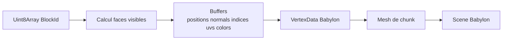
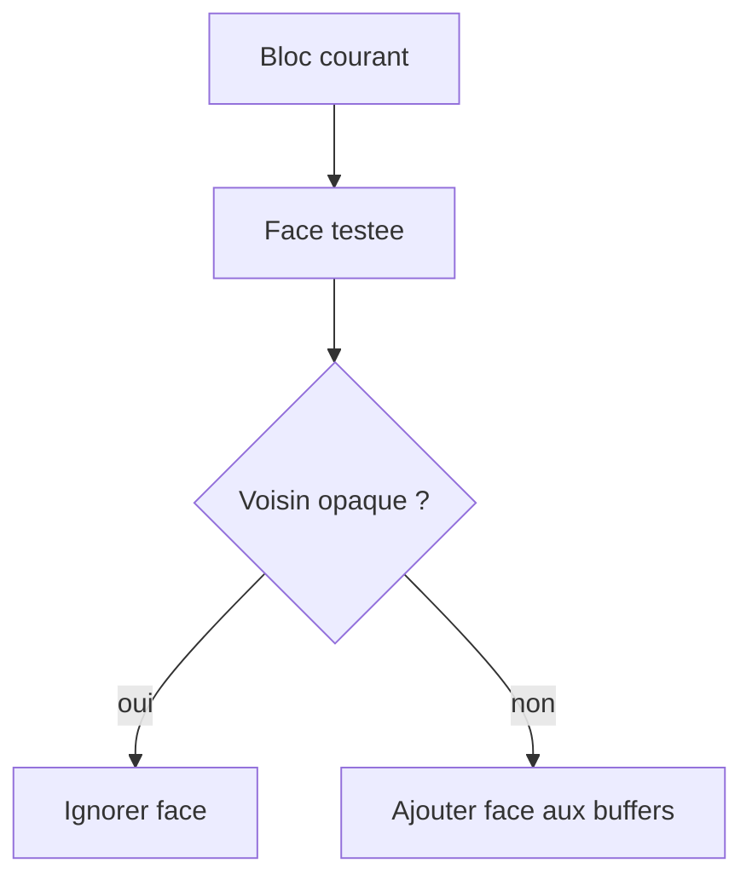
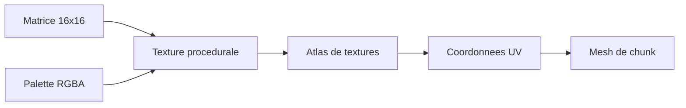
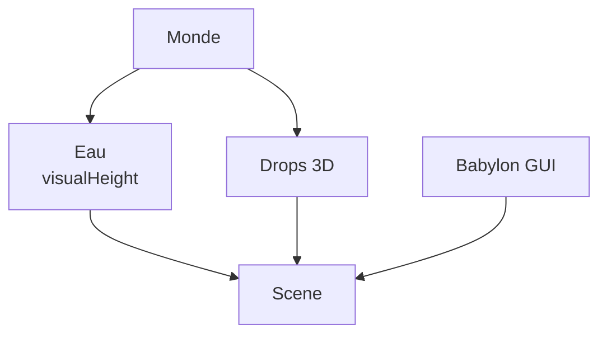

[⬅️ Précédent](./pwa-assets.md) | [Sommaire](./README.md) | [Suivant ➡️](./runtime-flow.md)

---

# Rendu, meshes, atlas et effets visuels

Le rendu est assuré par Babylon.js. Rust fournit les identifiants de blocs, puis TypeScript transforme ces données en géométrie affichable.

## Pipeline principal

```txt
Uint8Array de BlockId
  -> createChunkMesh(...)
  -> buffers positions/normals/indices/colors/uvs
  -> VertexData Babylon
  -> Mesh de chunk
```



## Chunks visibles

`createChunkMesh(...)` parcourt les blocs d'un chunk et génère uniquement la géométrie utile. Les faces internes entre blocs opaques ne sont pas créées.



## Textures

Les textures de blocs sont décrites dans les définitions TypeScript sous forme de matrices 16x16 avec palette de couleurs. Elles alimentent l'atlas utilisé par les meshes.



## Eau, drops et UI

L'eau est rendue avec une hauteur visuelle spécifique. Les drops réutilisent les textures des blocs. Les interfaces sont en Babylon GUI.



---

[⬅️ Précédent](./pwa-assets.md) | [Sommaire](./README.md) | [Suivant ➡️](./runtime-flow.md)
