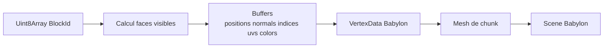
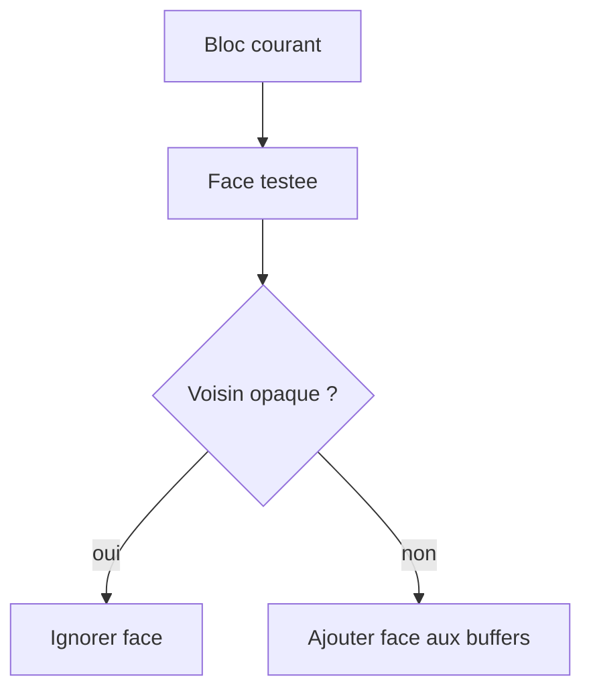
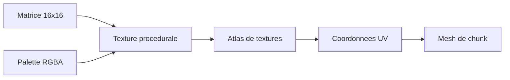
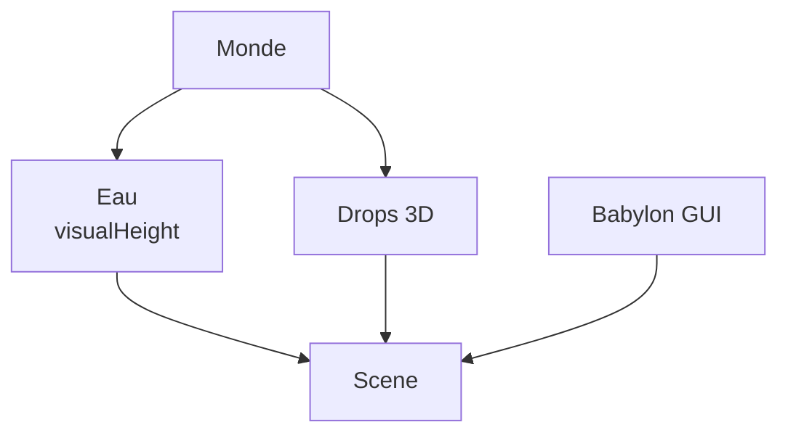
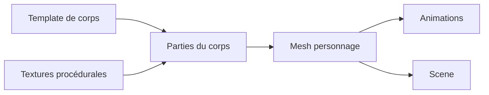

[⬅️ Précédent](./blocks-items-crafting.md) | [Sommaire](./README.md) | [Suivant ➡️](./avatar-physics.md)

---

# Rendu, meshes, atlas et effets visuels

Le rendu est assuré par Babylon.js. Rust fournit les identifiants de blocs, puis TypeScript transforme ces données en géométrie affichable.

## Pipeline principal

```txt
Uint8Array de BlockId
  -> createChunkMesh(...)
  -> buffers positions/normals/indices/colors/uvs
  -> VertexData Babylon
  -> Mesh de chunk
```



## Chunks visibles

`createChunkMesh(...)` parcourt les blocs d'un chunk et génère uniquement la géométrie utile. Les faces internes entre blocs opaques ne sont pas créées.



## Textures

Les textures de blocs sont décrites dans les définitions TypeScript sous forme de matrices 16x16 avec palette de couleurs. Elles alimentent l'atlas utilisé par les meshes.



## Eau, drops et UI

L'eau est rendue avec une hauteur visuelle spécifique. Les drops réutilisent les textures des blocs. Les interfaces sont en Babylon GUI.



## Personnages 3D

Le jeu utilise un système de personnages cubiques avec textures procédurales. Les personnages sont construits à partir de parties du corps (tête, torse, bras, jambes) assemblées en mesh unique.



### Construction des personnages

Les personnages sont construits à partir de cuboïdes texturés :

```txt
Matrices de couleurs 16x16
  + Palette RGBA
  -> Textures dynamiques
  -> Cuboïdes pour chaque partie
  -> Assemblage en mesh unique
```

### Types de personnages

- **Steve** : Modèle masculin avec bras larges (4×12×4 px)
- **Alex** : Modèle féminin avec bras fins (3×12×4 px)
- **Custom** : Modèle personnalisé avec proportions définies

### Animations des personnages

Les animations sont réalisées avec Babylon.js Animation Groups :

- **idle** : Position debout neutre
- **walk** : Marche avec balancement des bras
- **mine** : Animation de minage
- **jump** : Saut

Les animations sont identiques pour tous les types de corps. Seules les dimensions des parties changent.

---

[⬅️ Précédent](./blocks-items-crafting.md) | [Sommaire](./README.md) | [Suivant ➡️](./gameplay-interactions.md)
