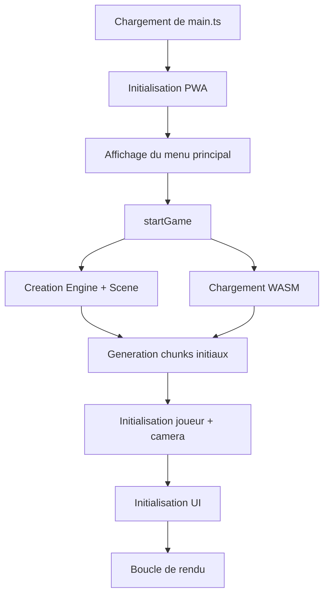
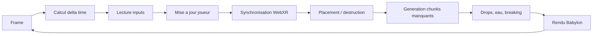
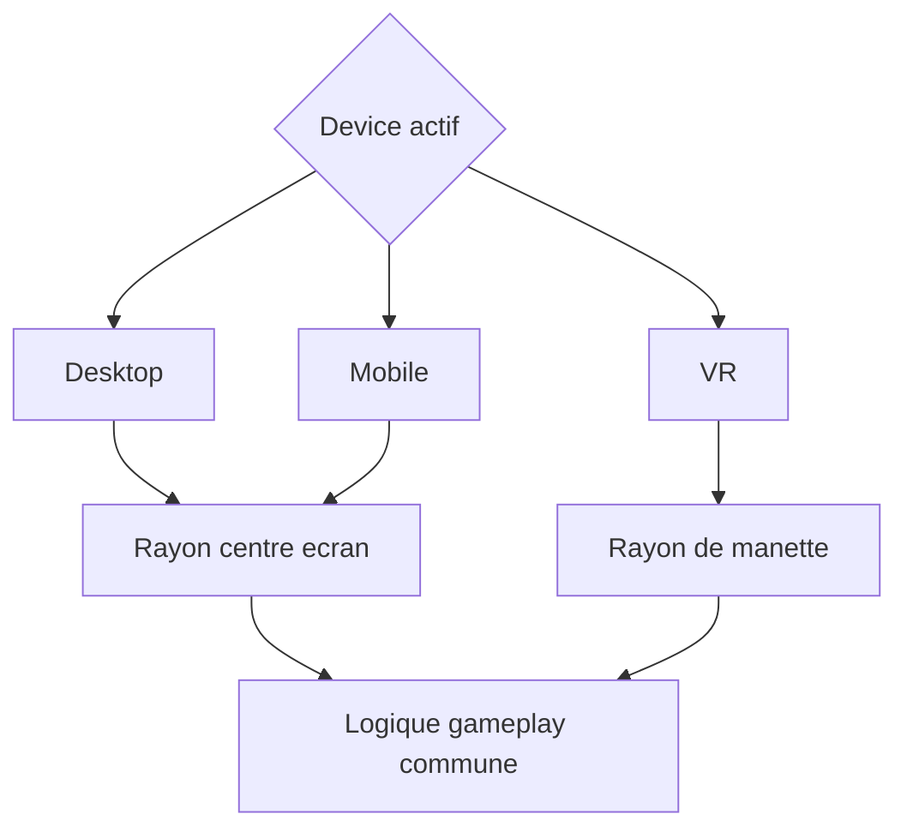

[⬅️ Précédent](./rendering-and-effects.md) | [Sommaire](./README.md) | [Suivant ➡️](./world-generation.md)

---

# Cycle de vie runtime

## Point d'entrée

Le runtime démarre dans `src/main.ts`. Il charge le WASM, initialise la PWA, crée Babylon, affiche le menu principal, puis démarre le jeu via `startGame()`.

## Chargement WebAssembly

`loadVoxelWasm()` initialise le module généré dans `src/assets/wasm`. La promesse est mémorisée pour éviter plusieurs initialisations concurrentes.

## Démarrage du jeu

`startGame()` crée la scène, applique le ciel, initialise lumière, matériau d'atlas, WASM, chunks initiaux, joueur, caméra, eau, UI, contrôles mobile, contrôles VR et boucle de rendu.

## Génération initiale

Les chunks autour du spawn sont générés via `generate_chunk(chunkX, chunkZ, SEED)`, puis convertis en meshes Babylon avec `createChunkMesh(...)`.

## Boucle de rendu

À chaque frame :

1. calcul du delta time ;
2. lecture des inputs desktop/mobile/VR ;
3. mise à jour du joueur ;
4. synchronisation WebXR ;
5. gestion placement/destruction ;
6. génération des chunks manquants ;
7. mise à jour des drops, effets d'eau et breaking ;
8. rendu de la scène.

## Rayons d'interaction

Desktop et mobile utilisent le centre de l'écran. La VR utilise les rayons des contrôleurs. Les fonctions de gameplay acceptent un `targetRay` optionnel pour partager la logique entre devices.

## Points d'extension

Pour ajouter un système runtime : créer un module dédié, l'initialiser dans `startGame()`, lui fournir le contexte nécessaire, puis appeler sa méthode `update` dans la boucle si besoin.

---

[⬅️ Précédent](./rendering-and-effects.md) | [Sommaire](./README.md) | [Suivant ➡️](./world-generation.md)
