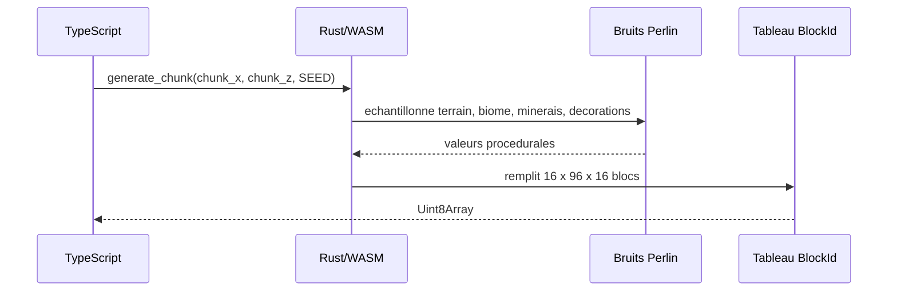
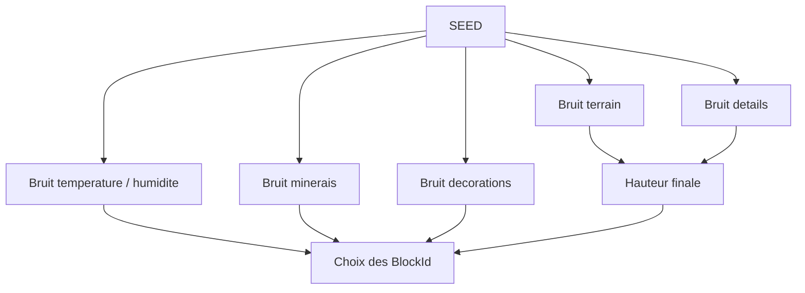
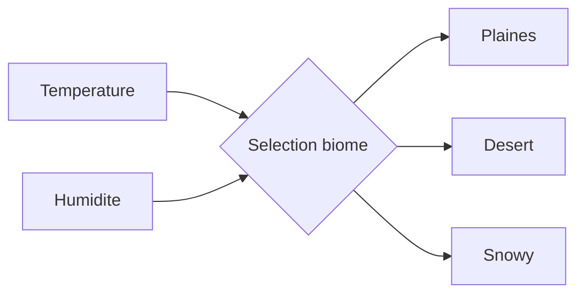
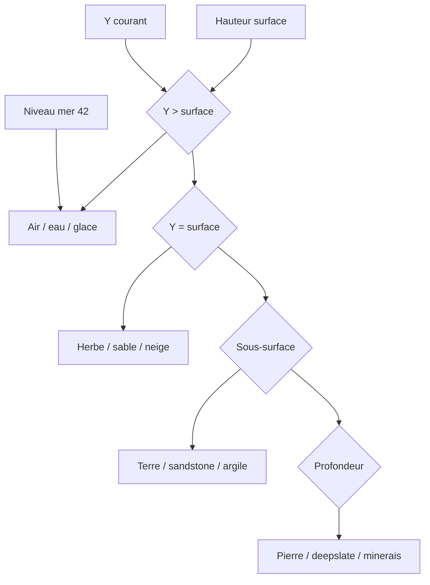
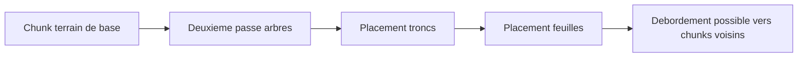

[⬅️ Précédent](./runtime-flow.md) | [Sommaire](./README.md)

---

# Génération procédurale du monde

## Responsabilité

La génération procédurale est réalisée dans `wasm/src/lib.rs`, côté Rust. TypeScript demande un chunk via `generate_chunk(chunk_x, chunk_z, seed)` et reçoit un tableau d'identifiants de blocs.

## Dimensions

Les chunks font actuellement `16 x 96 x 16`. Les dimensions sont exposées à TypeScript via `chunk_size_x()`, `chunk_size_y()` et `chunk_size_z()`.

## Bruits utilisés

La génération utilise plusieurs bruits de Perlin dérivés du seed : terrain, détails, reliefs internes, biomes, minerais et décorations.

## Biomes

Trois biomes existent actuellement : plaines, désert et snowy. Le choix dépend de valeurs de température et d'humidité.

## Terrain

La hauteur combine continents, collines, détails et modificateurs de biome. Le niveau de la mer est fixé à `42`.

## Couches

- Au-dessus de la surface : air, eau ou glace.
- Surface : herbe, sable ou neige selon le biome.
- Sous-surface : terre, sandstone ou variantes sous-marines.
- Profondeur : pierre, deepslate et minerais.

## Décorations

Les plaines peuvent générer hautes herbes, pissenlits et coquelicots. Le désert peut générer cactus et buissons morts. Les biomes enneigés peuvent générer des blocs de neige.

## Arbres

Les arbres sont générés en deuxième passe pour gérer le feuillage qui déborde entre chunks. Les arbres naturels actuels utilisent des troncs et feuilles de chêne.

## Synchronisation

`BlockId` doit rester aligné entre Rust et TypeScript. Toute nouvelle valeur doit être ajoutée des deux côtés si elle est générée par le monde.

---

[⬅️ Précédent](./runtime-flow.md) | [Sommaire](./README.md)
